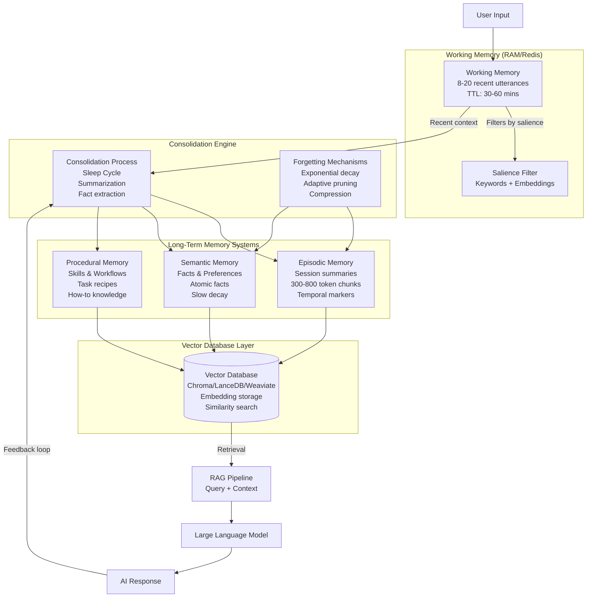
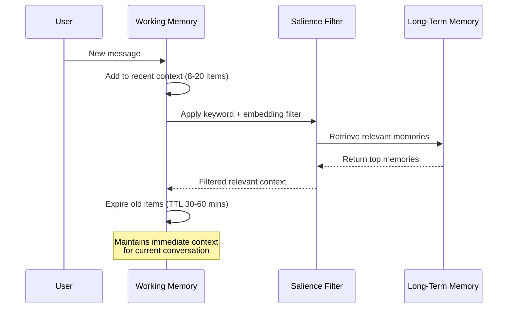
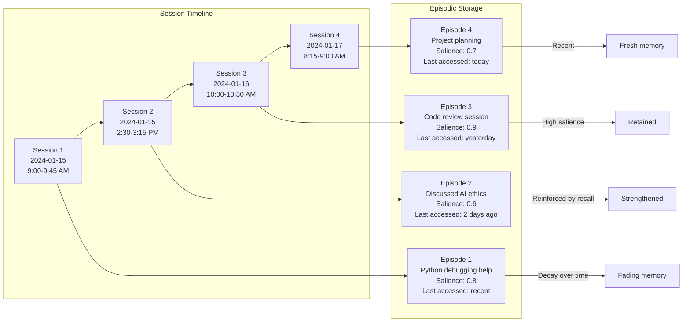

# A Human-Brain-Inspired Memory Architecture for Large Language Models

## Abstract

This paper presents a practical memory system for artificial conversational agents that emulates core components of human memory: working memory, episodic memory, semantic memory, and procedural memory. The design introduces mechanisms for consolidation, salience, and forgetting, ensuring memory remains relevant and scalable over time. By combining vector embeddings, lightweight keyword filters, and hybrid retrieval strategies, this architecture addresses the critical limitation that LLMs are likely to completely forget the content and information of previous conversations and provides local, production-ready memory that improves personalization, continuity, and factual accuracy in conversational AI systems. Recent advances in 2024-2025 have shown that LLMs lack episodic memory, and while RAG systems combine a dense retriever with an LLM, this architecture still faces fundamental challenges in maintaining temporal context and sequential information.

---

## 1. Introduction

Current large language models (LLMs) excel at language understanding but lack persistent memory, limiting their ability to maintain long-term coherence or adapt to users across sessions. When using LLM Q&A applications like ChatGPT, LLMs are likely to completely forget the content and information of your previous conversation, even within the same chat tab. Human memory, however, naturally organizes experiences into short-term awareness, episodic recollections, semantic knowledge, and procedural skills.

Recent research in 2024-2025 has highlighted that LLMs lack episodic memory. IBM Research emphasizes that while LLMs have long-term memory from training data, they lack "episodic memory, which is more contextual memory that can be rewritten and forgotten in seconds." In an attempt to combat this, Retrieval-Augmented Generation (RAG) systems combine a dense retriever with an LLM, conditioning the LLM's output on both a query and a document. However, RAG approaches extend LLM memory by incorporating external knowledge sources, typically stored in vector databases but still face challenges in maintaining temporal context and sequential information.

IBM Research's recent work on MemoryLLM compresses past information into hidden states across all layers, forming a memory pool of 1B parameters, though retaining information from the distant past remains challenging. Additionally, recent 2025 developments in AI agent memory frameworks show that unlike semantic memory which stores facts, episodic memory captures the full context of an interaction—the situation, the thought process that led to success, and why that approach worked.

This paper proposes a memory stack that operationalizes these categories in machine systems, using local embedding models and efficient retrieval mechanisms. The goal is to enable LLM-powered assistants to exhibit continuity, personalization, and adaptive forgetting, while avoiding uncontrolled data accumulation or unsafe storage practices.

---

## 2. Memory Architecture Overview

The following diagram illustrates the complete memory architecture with all four memory types and their interactions:



## 2. Memory Architecture

### 2.1 Working Memory (Short-Term / Attention Buffer)



Purpose: Maintain immediate conversational context.
Implementation: Store the most recent 8–20 utterances plus top relevant retrieved memories.
Storage: In-memory cache (RAM/Redis) with TTL of 30–60 minutes.
Filtering: Lightweight salience filter (keyword + embedding similarity).

**Code Example - Working Memory Implementation:**

```python
from datetime import datetime, timedelta
import redis
import json

class WorkingMemory:
    def __init__(self, redis_client, max_items=20, ttl_minutes=45):
        self.redis = redis_client
        self.max_items = max_items
        self.ttl = ttl_minutes * 60
        self.key = "working_memory"

    def add_utterance(self, text, speaker="user", importance=0.5):
        utterance = {
            "text": text,
            "speaker": speaker,
            "timestamp": datetime.now().isoformat(),
            "importance": importance
        }

        # Add to Redis list
        self.redis.lpush(self.key, json.dumps(utterance))

        # Trim to max items
        self.redis.ltrim(self.key, 0, self.max_items - 1)

        # Set TTL
        self.redis.expire(self.key, self.ttl)

    def get_context(self, include_retrieved=True):
        # Get recent utterances
        recent = self.redis.lrange(self.key, 0, -1)
        context = [json.loads(item) for item in recent]

        if include_retrieved:
            # Add relevant retrieved memories (simplified)
            retrieved = self.get_relevant_memories(context[-1]["text"] if context else "")
            context.extend(retrieved)

        return context

    def get_relevant_memories(self, query):
        # Placeholder for memory retrieval logic
        return []
```

### 2.2 Episodic Memory (Experiences Across Sessions)



Purpose: Capture session-level summaries and notable events with temporal markers. Modern AI agent frameworks define episodic memory as storing specific interactions or "episodes" that the agent has experienced, including concrete, instance-based memories of conversations and how interactions unfolded.
Implementation: Store 300–800 token event chunks and 1–3 session summaries with sequence order preservation.
Storage: Vector database (e.g., Chroma, LanceDB, Weaviate, Milvus, FAISS) with order-preserving capabilities.
Recent developments: Current theories suggest that context-absent from vanilla RAG is required for sequence order recall. Order-preserving (OP) variants of RAG can increase performance on sequence order recall tasks (SORT).

**Code Example - Episodic Memory Implementation:**

```python
import chromadb
from sentence_transformers import SentenceTransformer
from datetime import datetime
import uuid

class EpisodicMemory:
    def __init__(self, db_path="./chroma_db"):
        self.client = chromadb.PersistentClient(path=db_path)
        self.collection = self.client.get_or_create_collection("episodic_memory")
        self.encoder = SentenceTransformer('all-MiniLM-L6-v2')

    def store_episode(self, session_summary, context, importance=0.5):
        episode_id = str(uuid.uuid4())
        timestamp = datetime.now().isoformat()

        # Create episode chunk (300-800 tokens)
        episode_text = f"Session Summary: {session_summary}\nContext: {context[:500]}..."

        # Generate embedding
        embedding = self.encoder.encode([episode_text])[0].tolist()

        # Store with metadata
        self.collection.add(
            ids=[episode_id],
            embeddings=[embedding],
            documents=[episode_text],
            metadatas=[{
                "type": "episodic",
                "timestamp": timestamp,
                "importance": importance,
                "salience": importance,
                "frequency": 1,
                "last_accessed": timestamp,
                "session_length": len(context.split())
            }]
        )

        return episode_id

    def retrieve_episodes(self, query, n_results=5):
        query_embedding = self.encoder.encode([query])[0].tolist()

        results = self.collection.query(
            query_embeddings=[query_embedding],
            n_results=n_results,
            where={"type": "episodic"}
        )

        # Update access time and frequency
        for doc_id in results['ids'][0]:
            self.update_access_stats(doc_id)

        return results

    def update_access_stats(self, episode_id):
        # Update last_accessed and increment frequency
        metadata_update = {
            "last_accessed": datetime.now().isoformat()
        }
        # Note: ChromaDB doesn't support metadata updates directly
        # This would need additional implementation
        pass
```

### 2.3 Semantic Memory (Stable Facts and Preferences)

```mermaid
graph TB
    subgraph "Fact Extraction Pipeline"
        INPUT[User Statement:<br/>"I prefer dark mode<br/>and use Python daily"]

        EXTRACT[Fact Extractor<br/>Pattern matching +<br/>LLM assistance]

        FACTS[Extracted Facts:<br/>• Prefers dark mode<br/>• Uses Python daily<br/>• Programming experience: Yes]

        VALIDATE[Validation:<br/>Confidence scoring<br/>Evidence counting<br/>Contradiction detection]

        STORE[Atomic Fact Storage:<br/>Each fact separate<br/>Confidence scores<br/>Evidence links]
    end

    INPUT --> EXTRACT
    EXTRACT --> FACTS
    FACTS --> VALIDATE
    VALIDATE --> STORE

    subgraph "Semantic Memory Structure"
        PREF[Preferences<br/>UI: dark_mode=true<br/>Confidence: 0.95<br/>Evidence: 2 mentions]

        SKILLS[Skills & Abilities<br/>Python: daily_use<br/>Confidence: 0.90<br/>Evidence: 5 mentions]

        PROFILE[User Profile<br/>Role: Developer<br/>Confidence: 0.85<br/>Evidence: 3 mentions]

        CONTEXT[Contextual Facts<br/>Timezone: inferred<br/>Confidence: 0.60<br/>Evidence: 1 mention]
    end

    STORE --> PREF
    STORE --> SKILLS
    STORE --> PROFILE
    STORE --> CONTEXT

    subgraph "Fact Management"
        UPDATE[Fact Updates<br/>Merge similar<br/>Resolve conflicts<br/>Update confidence]

        DECAY[Slow Decay<br/>Requires reconfirmation<br/>Multiple evidence points<br/>Contradiction handling]
    end

    PREF --> UPDATE
    SKILLS --> UPDATE
    PROFILE --> UPDATE
    CONTEXT --> DECAY
```

Purpose: Retain persistent user facts, preferences, and identity markers. In cognitive architecture terms, semantic memory encompasses facts and concepts that form the foundation of an AI agent's knowledge base.
Implementation: Extract atomic facts (e.g., "User prefers dark mode") using pattern-based and LLM-assisted extraction.
Storage: Dedicated collection with stricter write rules and slower decay.

**Code Example - Semantic Memory Implementation:**

```python
import re
from typing import Dict, List, Tuple
from dataclasses import dataclass
from datetime import datetime

@dataclass
class SemanticFact:
    id: str
    fact_type: str  # preference, skill, profile, context
    key: str
    value: str
    confidence: float
    evidence_count: int
    created_at: str
    last_updated: str
    sources: List[str]

class SemanticMemory:
    def __init__(self, vector_db_collection):
        self.collection = vector_db_collection
        self.fact_patterns = {
            'preference': [
                r"I (?:prefer|like|enjoy|want) (.+)",
                r"My favorite (.+) is (.+)",
                r"I (?:always|usually|often) use (.+)"
            ],
            'skill': [
                r"I (?:know|use|work with|program in) (.+)",
                r"I'm (?:good at|experienced with) (.+)",
                r"I (?:can|am able to) (.+)"
            ],
            'profile': [
                r"I (?:am|work as) (?:a |an )?(.+)",
                r"My (?:job|role|profession) is (.+)",
                r"I (?:study|studied) (.+)"
            ]
        }

    def extract_facts(self, text: str, llm_assist=True) -> List[SemanticFact]:
        facts = []

        # Pattern-based extraction
        for fact_type, patterns in self.fact_patterns.items():
            for pattern in patterns:
                matches = re.finditer(pattern, text, re.IGNORECASE)
                for match in matches:
                    fact = self._create_fact(
                        fact_type=fact_type,
                        raw_match=match.groups(),
                        source=text,
                        confidence=0.7  # Pattern-based confidence
                    )
                    facts.append(fact)

        # LLM-assisted extraction (simplified)
        if llm_assist:
            llm_facts = self._llm_extract_facts(text)
            facts.extend(llm_facts)

        return facts

    def _create_fact(self, fact_type: str, raw_match: tuple,
                    source: str, confidence: float) -> SemanticFact:
        fact_id = f"{fact_type}_{hash(str(raw_match))}_{datetime.now().timestamp()}"

        if fact_type == 'preference':
            key, value = raw_match[0], "preferred"
        elif fact_type == 'skill':
            key, value = raw_match[0], "known"
        else:
            key, value = raw_match[0], raw_match[0]

        return SemanticFact(
            id=fact_id,
            fact_type=fact_type,
            key=key.strip(),
            value=value.strip(),
            confidence=confidence,
            evidence_count=1,
            created_at=datetime.now().isoformat(),
            last_updated=datetime.now().isoformat(),
            sources=[source[:100] + "..." if len(source) > 100 else source]
        )

    def store_fact(self, fact: SemanticFact, min_confidence=0.6):
        if fact.confidence < min_confidence:
            return False  # Reject low-confidence facts

        # Check for existing similar facts
        existing = self._find_similar_facts(fact)

        if existing:
            # Merge with existing fact
            self._merge_facts(existing[0], fact)
        else:
            # Store new fact
            self.collection.add(
                ids=[fact.id],
                embeddings=[self._encode_fact(fact)],
                documents=[f"{fact.key}: {fact.value}"],
                metadatas=[{
                    "type": "semantic",
                    "fact_type": fact.fact_type,
                    "key": fact.key,
                    "value": fact.value,
                    "confidence": fact.confidence,
                    "evidence_count": fact.evidence_count,
                    "created_at": fact.created_at,
                    "last_updated": fact.last_updated
                }]
            )

        return True

    def _find_similar_facts(self, fact: SemanticFact) -> List[SemanticFact]:
        # Search for similar facts (simplified)
        query_embedding = self._encode_fact(fact)
        results = self.collection.query(
            query_embeddings=[query_embedding],
            n_results=3,
            where={"fact_type": fact.fact_type}
        )

        # Convert results back to SemanticFact objects
        similar_facts = []
        # Implementation details omitted for brevity
        return similar_facts

    def _encode_fact(self, fact: SemanticFact) -> List[float]:
        # Encode fact for vector storage
        fact_text = f"{fact.fact_type}: {fact.key} = {fact.value}"
        # Use sentence transformer (implementation omitted)
        return [0.0] * 384  # Placeholder

    def _llm_extract_facts(self, text: str) -> List[SemanticFact]:
        # LLM-assisted fact extraction (placeholder)
        return []

    def _merge_facts(self, existing: SemanticFact, new: SemanticFact):
        # Merge logic for combining similar facts
        existing.confidence = min(0.95, existing.confidence + 0.1)
        existing.evidence_count += 1
        existing.last_updated = datetime.now().isoformat()
        existing.sources.extend(new.sources)
```

### 2.4 Procedural Memory (Skills and How-Tos)

```mermaid
flowchart TD
    subgraph "Procedural Memory Structure"
        TRIGGER[Trigger Patterns:<br/>"How do I..."<br/>"What's the process for..."<br/>"Steps to..."]

        SKILLS[Skill Categories]
        SKILLS --> CODE[Coding Tasks<br/>• Debug Python<br/>• Set up environment<br/>• Code review process]
        SKILLS --> WORKFLOW[Workflows<br/>• Project setup<br/>• Git workflow<br/>• Testing procedures]
        SKILLS --> TOOLS[Tool Usage<br/>• IDE shortcuts<br/>• Command line tricks<br/>• Library usage]

        CODE --> STEPS1[Step Lists<br/>1. Identify error<br/>2. Check logs<br/>3. Test fix]
        WORKFLOW --> STEPS2[Workflow Recipes<br/>1. Create branch<br/>2. Make changes<br/>3. Create PR]
        TOOLS --> STEPS3[Usage Guides<br/>1. Install package<br/>2. Import library<br/>3. Basic usage]
    end

    subgraph "Retrieval Process"
        QUERY[User Query:<br/>"How do I debug<br/>Python code?"]
        MATCH[Pattern Matching<br/>Keywords + Embeddings]
        RETRIEVE[Retrieve Procedures<br/>Ranked by relevance]
        CONTEXT[Contextualize<br/>Adapt to current situation]
        RESPONSE[Formatted Response<br/>Step-by-step guide]
    end

    TRIGGER --> MATCH
    QUERY --> MATCH
    MATCH --> RETRIEVE
    STEPS1 --> RETRIEVE
    STEPS2 --> RETRIEVE
    STEPS3 --> RETRIEVE
    RETRIEVE --> CONTEXT
    CONTEXT --> RESPONSE

    subgraph "Learning & Updates"
        FEEDBACK[User Feedback<br/>"This worked"<br/>"This didn't work"]
        UPDATE[Update Procedures<br/>Refine steps<br/>Add variations]
        NEW[Learn New Procedures<br/>Extract from successful<br/>problem-solving sessions]
    end

    RESPONSE --> FEEDBACK
    FEEDBACK --> UPDATE
    UPDATE --> CODE
    UPDATE --> WORKFLOW
    UPDATE --> TOOLS
    NEW --> SKILLS
```

Purpose: Retain learned workflows and instructions. This corresponds to implicit memory in cognitive models—skills and learned tasks that can be executed without conscious awareness.
Implementation: Short step lists or task recipes, retrieved during "how do I..." queries.

**Code Example - Procedural Memory Implementation:**

````python
from typing import Dict, List, Optional
import json
from dataclasses import dataclass, asdict

@dataclass
class ProcedureStep:
    step_number: int
    description: str
    code_example: Optional[str] = None
    expected_outcome: Optional[str] = None
    common_errors: List[str] = None

@dataclass
class Procedure:
    id: str
    title: str
    category: str
    description: str
    steps: List[ProcedureStep]
    triggers: List[str]  # Keywords that activate this procedure
    prerequisites: List[str] = None
    success_rate: float = 1.0
    last_used: str = None
    usage_count: int = 0

class ProceduralMemory:
    def __init__(self, vector_db_collection):
        self.collection = vector_db_collection
        self.procedures: Dict[str, Procedure] = {}
        self.trigger_patterns = [
            r"how (?:do|can) I (.+)",
            r"what(?:'s| is) the (?:process|steps) (?:for|to) (.+)",
            r"steps to (.+)",
            r"guide (?:for|to) (.+)",
            r"tutorial (?:for|on) (.+)"
        ]

    def store_procedure(self, procedure: Procedure):
        """Store a new procedure or update existing one"""
        # Store in local dict for fast access
        self.procedures[procedure.id] = procedure

        # Create searchable text combining all relevant info
        searchable_text = f"""
        {procedure.title} {procedure.description}
        Category: {procedure.category}
        Triggers: {' '.join(procedure.triggers)}
        Steps: {' '.join([step.description for step in procedure.steps])}
        """

        # Store in vector database
        self.collection.add(
            ids=[procedure.id],
            documents=[searchable_text.strip()],
            metadatas=[{
                "type": "procedural",
                "category": procedure.category,
                "title": procedure.title,
                "trigger_count": len(procedure.triggers),
                "step_count": len(procedure.steps),
                "success_rate": procedure.success_rate,
                "usage_count": procedure.usage_count
            }]
        )

    def retrieve_procedures(self, query: str, limit: int = 3) -> List[Procedure]:
        """Retrieve relevant procedures for a query"""
        # Search vector database
        results = self.collection.query(
            query_texts=[query],
            n_results=limit,
            where={"type": "procedural"}
        )

        # Get full procedure objects
        retrieved_procedures = []
        for proc_id in results['ids'][0]:
            if proc_id in self.procedures:
                procedure = self.procedures[proc_id]
                # Update usage stats
                procedure.usage_count += 1
                procedure.last_used = datetime.now().isoformat()
                retrieved_procedures.append(procedure)

        return retrieved_procedures

    def detect_procedural_query(self, text: str) -> bool:
        """Detect if query is asking for procedural knowledge"""
        import re

        for pattern in self.trigger_patterns:
            if re.search(pattern, text.lower()):
                return True

        # Check for procedural keywords
        procedural_keywords = [
            'how', 'steps', 'process', 'guide', 'tutorial',
            'instruction', 'method', 'way', 'procedure'
        ]

        return any(keyword in text.lower() for keyword in procedural_keywords)

    def learn_procedure_from_conversation(self, conversation_history: List[str],
                                        success_indicators: List[str] = None):
        """Extract new procedures from successful problem-solving conversations"""
        # This would analyze conversation history to identify:
        # 1. Problem statement
        # 2. Solution steps taken
        # 3. Success confirmation
        # 4. Extract as reusable procedure

        # Simplified implementation
        if not success_indicators:
            success_indicators = ["it worked", "that fixed it", "perfect", "solved"]

        # Check if conversation ended successfully
        last_messages = conversation_history[-3:]
        success_detected = any(
            indicator in msg.lower()
            for msg in last_messages
            for indicator in success_indicators
        )

        if success_detected:
            # Extract procedure (would use LLM in real implementation)
            extracted_procedure = self._extract_procedure_pattern(conversation_history)
            if extracted_procedure:
                self.store_procedure(extracted_procedure)

    def _extract_procedure_pattern(self, conversation: List[str]) -> Optional[Procedure]:
        """Extract procedure pattern from conversation (simplified)"""
        # In a real implementation, this would use LLM to analyze
        # the conversation and extract step-by-step procedures

        # For now, return a placeholder
        return None

    def format_procedure_response(self, procedures: List[Procedure],
                                 query: str) -> str:
        """Format procedures into a helpful response"""
        if not procedures:
            return "I don't have specific procedures for that task yet."

        response = f"Here are the procedures I found for '{query}':\n\n"

        for i, proc in enumerate(procedures, 1):
            response += f"## {i}. {proc.title}\n"
            response += f"{proc.description}\n\n"

            response += "### Steps:\n"
            for step in proc.steps:
                response += f"{step.step_number}. {step.description}\n"

                if step.code_example:
                    response += f"   ```\n   {step.code_example}\n   ```\n"

                if step.expected_outcome:
                    response += f"   Expected: {step.expected_outcome}\n"

                response += "\n"

            if proc.prerequisites:
                response += f"Prerequisites: {', '.join(proc.prerequisites)}\n"

            response += f"Success rate: {proc.success_rate:.1%}\n"
            response += f"Used {proc.usage_count} times\n\n"
            response += "---\n\n"

        return response

# Example usage and sample procedures
def create_sample_procedures():
    """Create some sample procedures for demonstration"""

    debug_python = Procedure(
        id="debug_python_code",
        title="Debug Python Code",
        category="coding",
        description="Step-by-step process for debugging Python applications",
        triggers=["debug python", "python debugging", "fix python error", "python not working"],
        steps=[
            ProcedureStep(
                1,
                "Read the error message carefully and identify the error type",
                expected_outcome="Understanding of what went wrong"
            ),
            ProcedureStep(
                2,
                "Check the line number mentioned in the traceback",
                code_example="# Look for the line number in traceback:\n# File \"script.py\", line 42, in <module>",
                expected_outcome="Located the problematic code line"
            ),
            ProcedureStep(
                3,
                "Add print statements or use debugger to inspect variables",
                code_example="print(f\"Variable value: {variable_name}\")\n# or use pdb\nimport pdb; pdb.set_trace()",
                common_errors=["Forgetting to remove debug prints", "Not checking variable types"]
            ),
            ProcedureStep(
                4,
                "Test the fix with various input cases",
                expected_outcome="Code runs without errors on test cases"
            )
        ],
        prerequisites=["Python installed", "Basic Python knowledge"],
        success_rate=0.85
    )

    git_workflow = Procedure(
        id="git_feature_workflow",
        title="Git Feature Branch Workflow",
        category="workflow",
        description="Standard workflow for developing features using Git",
        triggers=["git workflow", "feature branch", "how to use git", "git process"],
        steps=[
            ProcedureStep(1, "Create and switch to new feature branch",
                         code_example="git checkout -b feature/new-feature"),
            ProcedureStep(2, "Make your changes and test them locally"),
            ProcedureStep(3, "Stage and commit changes",
                         code_example="git add .\ngit commit -m \"Add new feature\""),
            ProcedureStep(4, "Push branch to remote",
                         code_example="git push origin feature/new-feature"),
            ProcedureStep(5, "Create pull request for code review"),
            ProcedureStep(6, "Merge after approval and delete branch")
        ],
        success_rate=0.95
    )

    return [debug_python, git_workflow]
````

---

## 3. Consolidation, Salience, and Forgetting

### 3.1 Consolidation Process ("Sleep Cycle")

Executed periodically or at session end:

1. Summarize recent context into episodic snippets.
2. Extract candidate semantic facts with confidence scores.
3. Merge and deduplicate overlapping information.
4. Update salience for referenced items.

Recent research in 2025 suggests implementing dual-memory architectures with synaptic consolidation and experience replay to mitigate forgetting, drawing inspiration from cognitive concepts like memory reconsolidation and bounded memory capacity.

### 3.2 Salience Scoring

Each memory unit is ranked using a weighted combination of similarity, recency, frequency, explicitness, importance, and type weighting.

Formula:
score = 0.45 × similarity + 0.20 × recency + 0.15 × frequency + 0.10 × importance + 0.10 × type_weight

Scores are normalized to [0,1] and tuned per application.

### 3.3 Forgetting Mechanisms

Episodic memory: Exponential decay unless reinforced, with localized query functions for efficient information retrieval to minimize catastrophic forgetting.
Semantic memory: Slow decay; requires reconfirmation or multiple evidence points.
Compression: Periodic clustering and centroid summarization with rehearsal mechanisms to prevent catastrophic interference.
Adaptive forgetting: Vector databases serve as a robust memory layer that mimics how humans remember concepts rather than exact words, allowing AI to remember what matters and forget what doesn't. This follows the principle of going "Beyond the Forgetting Curve" as explored in recent 2025 memory frameworks.

---

## 4. Data Model

A unified schema is proposed, including fields for id, type, text, embedding, created_at, last_seen_at, importance, frequency, and salience. Specialized structures store episodic summaries (with time ranges) and semantic facts (with confidence and evidence counts).

Recent 2025 implementations emphasize storing information as embeddings in vector databases, where agents query using semantic similarity rather than exact keywords, enabling recall of loosely related contexts.

---

## 5. Retrieval for Augmented Generation (RAG)

The retrieval pipeline includes:

1. Embedding the user query.
2. Performing top-K retrieval per memory type.
3. Hybrid search (lexical + vector).
4. Re-ranking by salience.
5. Assembling a context package (working memory, semantic, episodic, and procedural) for LLM input.

This ensures the model operates with a coherent and personalized memory snapshot. Modern frameworks like LangChain and LangGraph provide specialized modules for implementing these memory patterns in production systems.

---

## 6. Implementation

### 6.1 Embedding Models

Recommended local embedding models include:

BAAI/bge-base-en-v1.5 (GPU, retrieval-optimized) - Enhanced retrieval-augmented embeddings from 2023.
sentence-transformers/all-mpnet-base-v2 (general-purpose).
all-MiniLM-L6-v2 (CPU-efficient).
TinyGPT and TinyGPT-V - Recent 2024 developments showing that performance doesn't always require massive model size.

Hardware Requirements (2025): Running modern LLMs locally requires typical desktops or laptops with fast NVMe SSDs, 16–64GB of RAM, and (ideally) a discrete GPU. The more VRAM available, the larger the model that can be run efficiently.

### 6.2 Vector Database Landscape 2025

The 2025 vector database ecosystem has seen significant advances:

Top vector databases include Pinecone, Weaviate, Chroma, Qdrant, and Milvus, each optimizing for different use cases.
Vector databases now focus on enterprise-scale deployments with improved efficiency and cost-effectiveness.
These systems have become the "memory layer of AI," enabling semantic search and contextual recall that mirrors human cognitive processes.

### 6.3 Example Code

Python examples demonstrate:

Adding semantic and episodic memories.
Retrieval with salience-based ranking.
Consolidation passes with fact extraction and summarization.
Integration with modern frameworks like LangChain for production deployment.

---

## 7. Operational Considerations

Write rules: Semantic facts require explicit confirmation or ≥2 observations.
Feedback loop: Reinforce memories when retrieval proves useful.
Privacy & security: Encrypt at rest, allow inspection/deletion, avoid storing secrets.
Scaling: Shard by user, cluster and summarize long-tail histories. Vector databases in 2025 focus on enterprise-scale deployments with improved efficiency.
Evaluation: Measure retrieval hit rate, contextual relevance, hallucination reduction, and sequence order recall performance.
Memory networks: Implement localized query functions for efficient information retrieval from memory units to minimize catastrophic forgetting.
Infinite Retrieval and Cascading KV Cache: Recent 2025 techniques optimize LLMs for massive inputs with minimal memory and computation requirements.

Recent 2025 best practices emphasize building AI agents that "actually remember" by implementing sophisticated memory management that goes beyond simple conversation logging to include intelligent consolidation, selective forgetting, and context-aware retrieval.

---

## 8. Discussion

This architecture bridges biological memory theory and machine implementation. Unlike naïve long-term logging, it dynamically prioritizes and forgets information, balancing efficiency, accuracy, and safety. This technology mimics how humans remember concepts rather than exact words, allowing AI to be more helpful, personalized, and efficient.

Recent research has shown that temporal knowledge graph embeddings might be models also for cognitive episodic memory (facts we remember and can recollect) and that a semantic memory (current facts we know) can be generated from episodic memory by a marginalization operation.

The 2024-2025 landscape has seen major breakthroughs in open-source LLMs, with stronger collaboration and wider accessibility accelerating progress at an unprecedented pace. Contemporary research emphasizes that AI models increasingly adopt dual-memory architectures, drawing from cognitive concepts like memory reconsolidation and bounded memory capacity to create more human-like memory systems.

Future work may integrate reinforcement learning to adapt salience scoring, employ multimodal embeddings for richer contextualization, and leverage advances in memory consolidation from a reinforcement learning perspective. The integration of frameworks like Mem0.ai and advanced vector database architectures will likely drive the next generation of memory-augmented AI systems.

---

## 9. Conclusion

We have outlined a human-brain-inspired memory stack for conversational AI, incorporating working, episodic, semantic, and procedural memory, alongside consolidation, salience, and forgetting mechanisms. This design offers a scalable and privacy-conscious foundation for personalized, context-aware AI systems that can truly remember and learn from interactions over time.

The 2025 state of AI memory systems shows remarkable progress toward creating agents that maintain context, learn from experience, and provide increasingly personalized interactions while respecting privacy and computational constraints.

---

## References

1. Tulving, E. (1972). Episodic and semantic memory. Organization of Memory.
2. Baddeley, A. D. (1992). Working memory. Science, 255(5044), 556–559.
3. Johnson-Laird, P. N. (1983). Mental Models: Towards a Cognitive Science of Language, Inference, and Consciousness. Harvard University Press.
4. Reimers, N., & Gurevych, I. (2019). Sentence-BERT: Sentence embeddings using Siamese BERT-networks. EMNLP.
5. Zheng, X. et al. (2023). BGE: Enhanced retrieval-augmented embeddings. arXiv preprint arXiv:2305.12103.
6. Wang, H. et al. (2024). MemoryLLM: Towards self-updatable large language models. IBM Research.
7. Zhang, Y. et al. (2024). When Large Language Models Meet Vector Databases: A Survey. arXiv preprint arXiv:2402.01763v2.
8. Yu, S. et al. (2024). Assessing Episodic Memory in LLMs with Sequence Order Recall Tasks. arXiv preprint arXiv:2410.08133v1.
9. Lewis, P. et al. (2020). Retrieval-Augmented Generation for Knowledge-Intensive NLP Tasks. NeurIPS.
10. Babiya, Y. (2025). How LLMs Use Vector Databases for Long-Term Memory: A Beginner's Guide. Medium.
11. IBM Research (2024). How memory augmentation can improve large language models. IBM Research Blog.
12. Ritter, S. et al. (2025). Rethinking Memory in AI: Taxonomy, Operations, Topics, and Future Directions. arXiv preprint arXiv:2505.00675v1.
13. LangChain AI (2025). Long-term Memory in LLM Applications: Conceptual Guide.
14. Islam, N. (2025). Building AI Agents That Actually Remember: A Developer's Guide to Memory Management in 2025. Medium.
