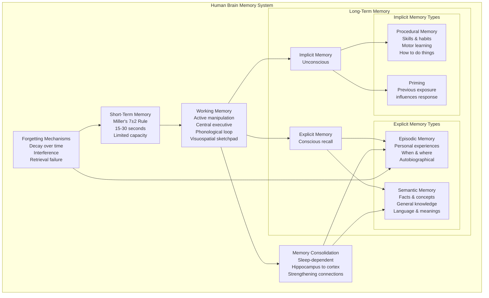
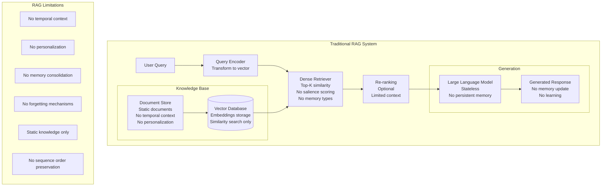
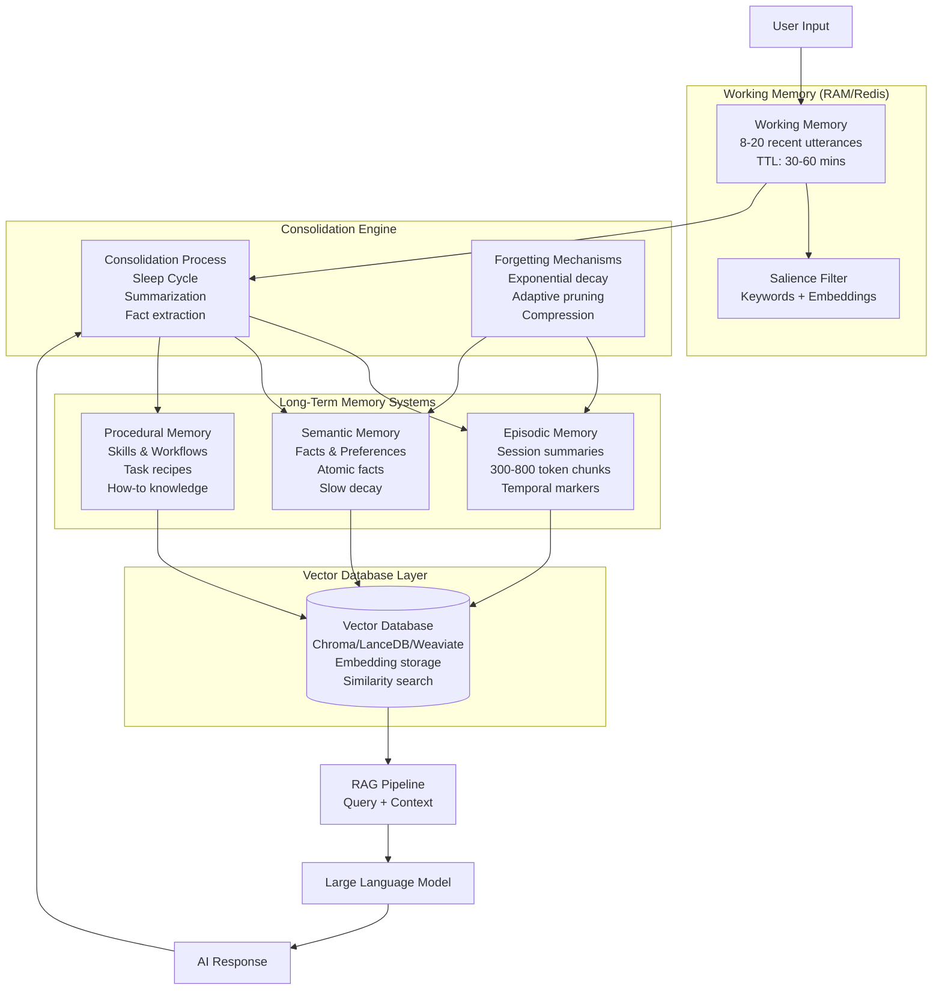
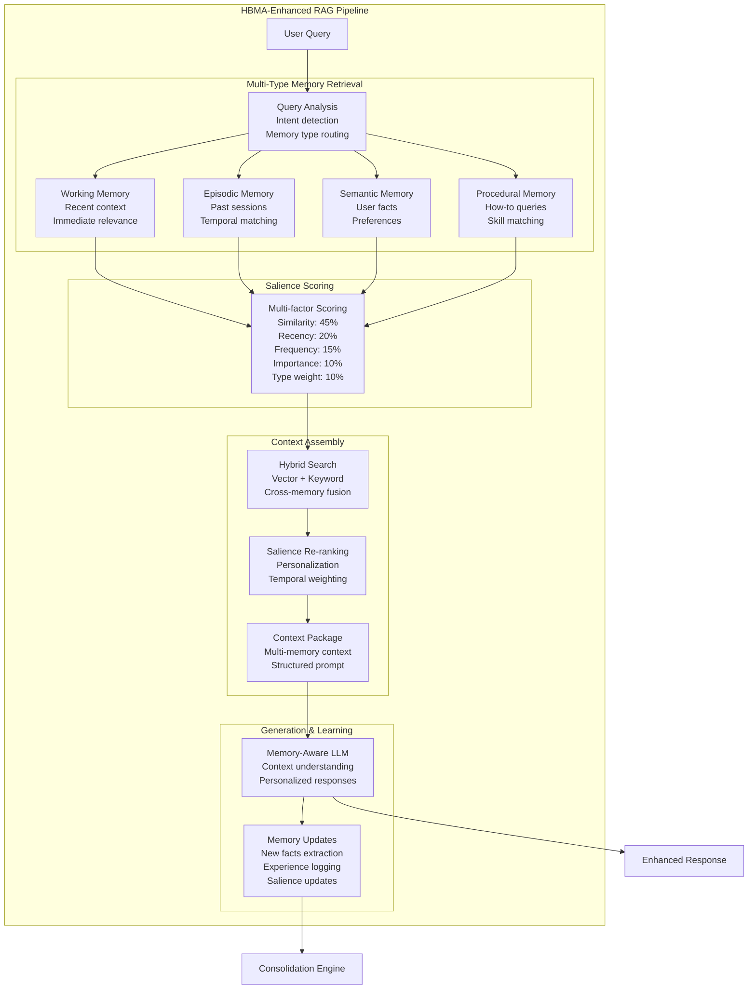
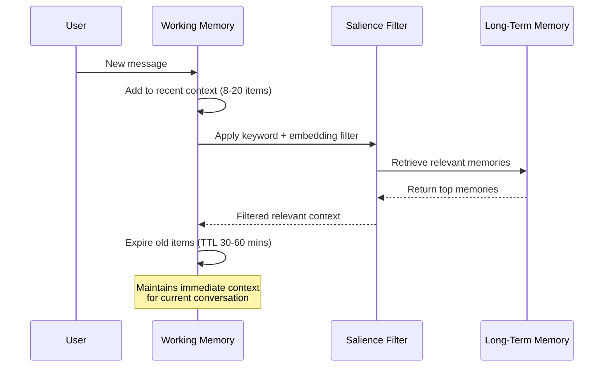
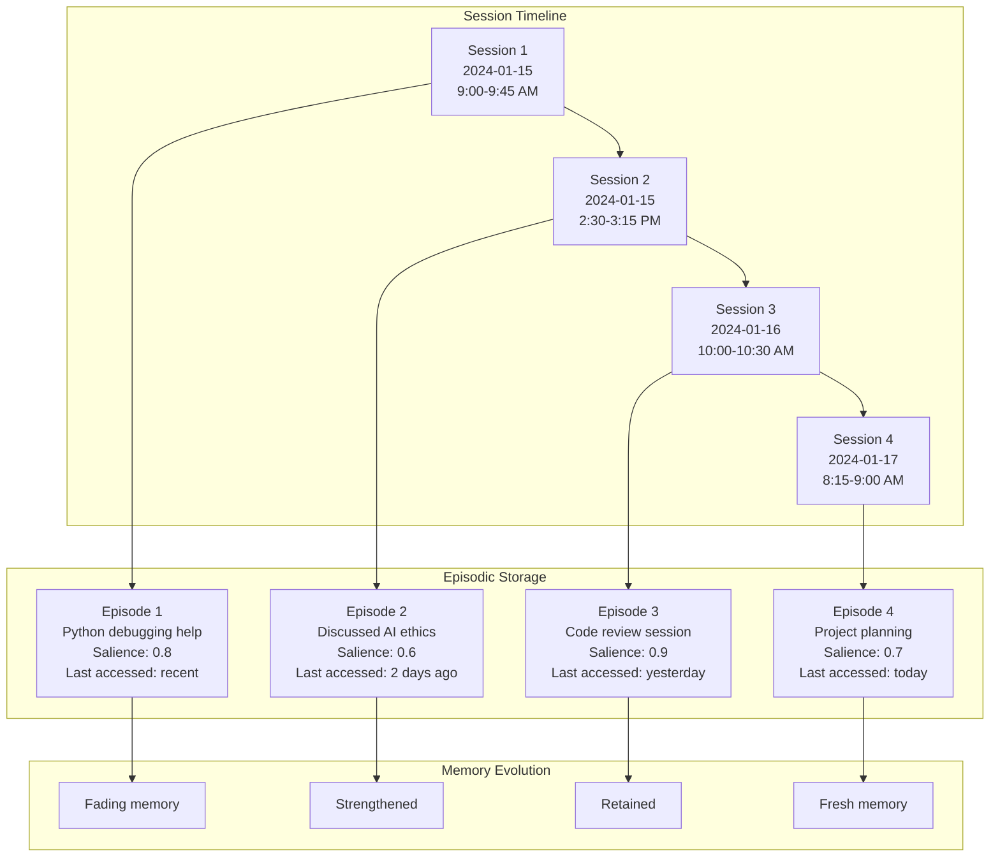
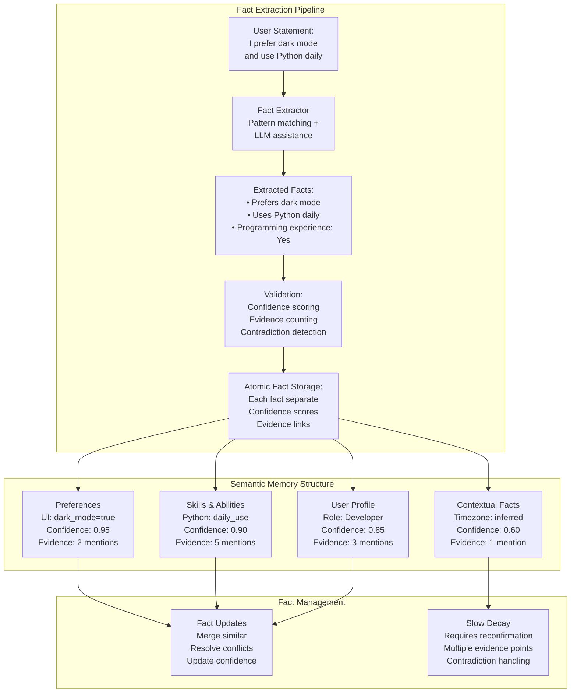
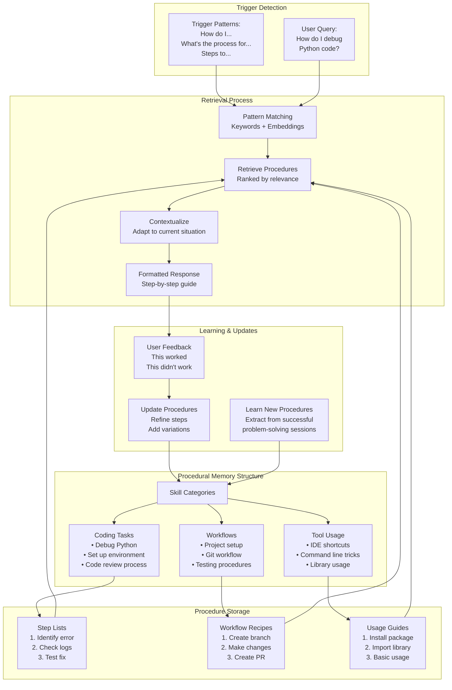
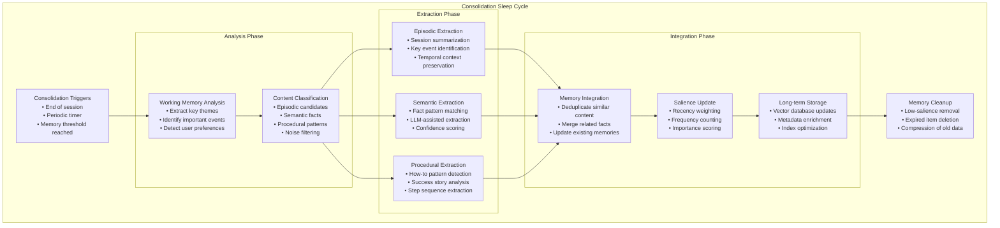
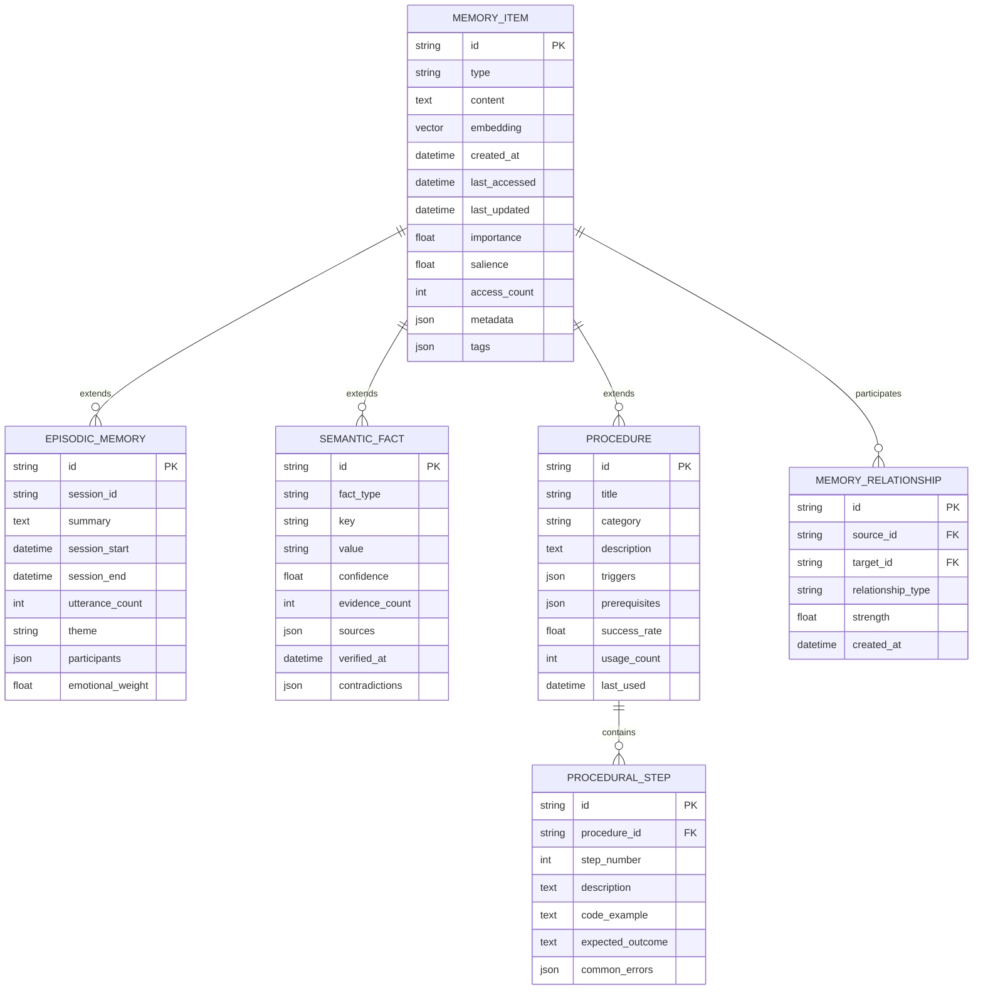

# A Human-Brain-Inspired Memory Architecture for Large Language Models

## Abstract

This paper presents a practical memory system for artificial conversational agents that emulates core components of human memory: working memory, episodic memory, semantic memory, and procedural memory. The design introduces mechanisms for consolidation, salience, and forgetting, ensuring memory remains relevant and scalable over time. By combining vector embeddings, lightweight keyword filters, and hybrid retrieval strategies, this architecture addresses the critical limitation that LLMs are likely to completely forget the content and information of previous conversations and provides local, production-ready memory that improves personalization, continuity, and factual accuracy in conversational AI systems. Recent advances in 2024-2025 have shown that LLMs lack episodic memory, and while RAG systems combine a dense retriever with an LLM, this architecture still faces fundamental challenges in maintaining temporal context and sequential information.

---

## 1. Introduction

Current large language models (LLMs) excel at language understanding but lack persistent memory, limiting their ability to maintain long-term coherence or adapt to users across sessions. When using LLM Q&A applications like ChatGPT, LLMs are likely to completely forget the content and information of your previous conversation, even within the same chat tab. Human memory, however, naturally organizes experiences into short-term awareness, episodic recollections, semantic knowledge, and procedural skills.

Recent research in 2024-2025 has highlighted that LLMs lack episodic memory. IBM Research emphasizes that while LLMs have long-term memory from training data, they lack "episodic memory, which is more contextual memory that can be rewritten and forgotten in seconds." In an attempt to combat this, Retrieval-Augmented Generation (RAG) systems combine a dense retriever with an LLM, conditioning the LLM's output on both a query and a document. However, RAG approaches extend LLM memory by incorporating external knowledge sources, typically stored in vector databases but still face challenges in maintaining temporal context and sequential information.

IBM Research's recent work on MemoryLLM compresses past information into hidden states across all layers, forming a memory pool of 1B parameters, though retaining information from the distant past remains challenging. Additionally, recent 2025 developments in AI agent memory frameworks show that unlike semantic memory which stores facts, episodic memory captures the full context of an interaction—the situation, the thought process that led to success, and why that approach worked.

This paper proposes a memory stack that operationalizes these categories in machine systems, using local embedding models and efficient retrieval mechanisms. The goal is to enable LLM-powered assistants to exhibit continuity, personalization, and adaptive forgetting, while avoiding uncontrolled data accumulation or unsafe storage practices.

---

## 2. Human Brain Memory Model

Before diving into our architecture, it's important to understand how human memory works as inspiration for our system.



## 3. Traditional RAG Architecture

Current RAG systems provide some memory capability but have significant limitations:



## 4. Memory Architecture Overview

The following diagram illustrates the complete HBMA memory architecture with all four memory types and their interactions:



## 5. HBMA-Enhanced RAG Process

Our enhanced RAG process incorporates multiple memory types and intelligent retrieval:



## 6. Memory Architecture Components

### 6.1 Working Memory (Short-Term / Attention Buffer)



**Purpose**: Maintain immediate conversational context.

**Implementation**: Store the most recent 8–20 utterances plus top relevant retrieved memories.

**Storage**: In-memory cache (RAM/Redis) with TTL of 30–60 minutes.

**Filtering**: Lightweight salience filter (keyword + embedding similarity).

**Code Example - Working Memory Implementation:**

```python
from datetime import datetime, timedelta
import redis
import json

class WorkingMemory:
    def __init__(self, redis_client, max_items=20, ttl_minutes=45):
        self.redis = redis_client
        self.max_items = max_items
        self.ttl = ttl_minutes * 60
        self.key = "working_memory"

    def add_utterance(self, text, speaker="user", importance=0.5):
        utterance = {
            "text": text,
            "speaker": speaker,
            "timestamp": datetime.now().isoformat(),
            "importance": importance
        }

        # Add to Redis list
        self.redis.lpush(self.key, json.dumps(utterance))

        # Trim to max items
        self.redis.ltrim(self.key, 0, self.max_items - 1)

        # Set TTL
        self.redis.expire(self.key, self.ttl)

    def get_context(self, include_retrieved=True):
        # Get recent utterances
        recent = self.redis.lrange(self.key, 0, -1)
        context = [json.loads(item) for item in recent]

        if include_retrieved:
            # Add relevant retrieved memories (simplified)
            retrieved = self.get_relevant_memories(context[-1]["text"] if context else "")
            context.extend(retrieved)

        return context

    def get_relevant_memories(self, query):
        # Placeholder for memory retrieval logic
        return []
```

### 6.2 Episodic Memory (Experiences Across Sessions)



**Purpose**: Capture session-level summaries and notable events with temporal markers. Modern AI agent frameworks define episodic memory as storing specific interactions or "episodes" that the agent has experienced, including concrete, instance-based memories of conversations and how interactions unfolded.

**Implementation**: Store 300–800 token event chunks and 1–3 session summaries with sequence order preservation.

**Storage**: Vector database (e.g., Chroma, LanceDB, Weaviate, Milvus, FAISS) with order-preserving capabilities.

**Recent developments**: Current theories suggest that context-absent from vanilla RAG is required for sequence order recall. Order-preserving (OP) variants of RAG can increase performance on sequence order recall tasks (SORT).

**Code Example - Episodic Memory Implementation:**

```python
import chromadb
from sentence_transformers import SentenceTransformer
from datetime import datetime
import uuid

class EpisodicMemory:
    def __init__(self, db_path="./chroma_db"):
        self.client = chromadb.PersistentClient(path=db_path)
        self.collection = self.client.get_or_create_collection("episodic_memory")
        self.encoder = SentenceTransformer('all-MiniLM-L6-v2')

    def store_episode(self, session_summary, context, importance=0.5):
        episode_id = str(uuid.uuid4())
        timestamp = datetime.now().isoformat()

        # Create episode chunk (300-800 tokens)
        episode_text = f"Session Summary: {session_summary}\nContext: {context[:500]}..."

        # Generate embedding
        embedding = self.encoder.encode([episode_text])[0].tolist()

        # Store with metadata
        self.collection.add(
            ids=[episode_id],
            embeddings=[embedding],
            documents=[episode_text],
            metadatas=[{
                "type": "episodic",
                "timestamp": timestamp,
                "importance": importance,
                "salience": importance,
                "frequency": 1,
                "last_accessed": timestamp,
                "session_length": len(context.split())
            }]
        )

        return episode_id

    def retrieve_episodes(self, query, n_results=5):
        query_embedding = self.encoder.encode([query])[0].tolist()

        results = self.collection.query(
            query_embeddings=[query_embedding],
            n_results=n_results,
            where={"type": "episodic"}
        )

        # Update access time and frequency
        for doc_id in results['ids'][0]:
            self.update_access_stats(doc_id)

        return results

    def update_access_stats(self, episode_id):
        # Update last_accessed and increment frequency
        metadata_update = {
            "last_accessed": datetime.now().isoformat()
        }
        # Note: ChromaDB doesn't support metadata updates directly
        # This would need additional implementation
        pass
```

### 6.3 Semantic Memory (Stable Facts and Preferences)



**Purpose**: Retain persistent user facts, preferences, and identity markers. In cognitive architecture terms, semantic memory encompasses facts and concepts that form the foundation of an AI agent's knowledge base.

**Implementation**: Extract atomic facts (e.g., "User prefers dark mode") using pattern-based and LLM-assisted extraction.

**Storage**: Dedicated collection with stricter write rules and slower decay.

**Code Example - Semantic Memory Implementation:**

```python
import re
from typing import Dict, List, Tuple
from dataclasses import dataclass
from datetime import datetime

@dataclass
class SemanticFact:
    id: str
    fact_type: str  # preference, skill, profile, context
    key: str
    value: str
    confidence: float
    evidence_count: int
    created_at: str
    last_updated: str
    sources: List[str]

class SemanticMemory:
    def __init__(self, vector_db_collection):
        self.collection = vector_db_collection
        self.fact_patterns = {
            'preference': [
                r"I (?:prefer|like|enjoy|want) (.+)",
                r"My favorite (.+) is (.+)",
                r"I (?:always|usually|often) use (.+)"
            ],
            'skill': [
                r"I (?:know|use|work with|program in) (.+)",
                r"I'm (?:good at|experienced with) (.+)",
                r"I (?:can|am able to) (.+)"
            ],
            'profile': [
                r"I (?:am|work as) (?:a |an )?(.+)",
                r"My (?:job|role|profession) is (.+)",
                r"I (?:study|studied) (.+)"
            ]
        }

    def extract_facts(self, text: str, llm_assist=True) -> List[SemanticFact]:
        facts = []

        # Pattern-based extraction
        for fact_type, patterns in self.fact_patterns.items():
            for pattern in patterns:
                matches = re.finditer(pattern, text, re.IGNORECASE)
                for match in matches:
                    fact = self._create_fact(
                        fact_type=fact_type,
                        raw_match=match.groups(),
                        source=text,
                        confidence=0.7  # Pattern-based confidence
                    )
                    facts.append(fact)

        # LLM-assisted extraction (simplified)
        if llm_assist:
            llm_facts = self._llm_extract_facts(text)
            facts.extend(llm_facts)

        return facts

    def _create_fact(self, fact_type: str, raw_match: tuple,
                    source: str, confidence: float) -> SemanticFact:
        fact_id = f"{fact_type}_{hash(str(raw_match))}_{datetime.now().timestamp()}"

        if fact_type == 'preference':
            key, value = raw_match[0], "preferred"
        elif fact_type == 'skill':
            key, value = raw_match[0], "known"
        else:
            key, value = raw_match[0], raw_match[0]

        return SemanticFact(
            id=fact_id,
            fact_type=fact_type,
            key=key.strip(),
            value=value.strip(),
            confidence=confidence,
            evidence_count=1,
            created_at=datetime.now().isoformat(),
            last_updated=datetime.now().isoformat(),
            sources=[source[:100] + "..." if len(source) > 100 else source]
        )

    def store_fact(self, fact: SemanticFact, min_confidence=0.6):
        if fact.confidence < min_confidence:
            return False  # Reject low-confidence facts

        # Check for existing similar facts
        existing = self._find_similar_facts(fact)

        if existing:
            # Merge with existing fact
            self._merge_facts(existing[0], fact)
        else:
            # Store new fact
            self.collection.add(
                ids=[fact.id],
                embeddings=[self._encode_fact(fact)],
                documents=[f"{fact.key}: {fact.value}"],
                metadatas=[{
                    "type": "semantic",
                    "fact_type": fact.fact_type,
                    "key": fact.key,
                    "value": fact.value,
                    "confidence": fact.confidence,
                    "evidence_count": fact.evidence_count,
                    "created_at": fact.created_at,
                    "last_updated": fact.last_updated
                }]
            )

        return True

    def _find_similar_facts(self, fact: SemanticFact) -> List[SemanticFact]:
        # Search for similar facts (simplified)
        query_embedding = self._encode_fact(fact)
        results = self.collection.query(
            query_embeddings=[query_embedding],
            n_results=3,
            where={"fact_type": fact.fact_type}
        )

        # Convert results back to SemanticFact objects
        similar_facts = []
        # Implementation details omitted for brevity
        return similar_facts

    def _encode_fact(self, fact: SemanticFact) -> List[float]:
        # Encode fact for vector storage
        fact_text = f"{fact.fact_type}: {fact.key} = {fact.value}"
        # Use sentence transformer (implementation omitted)
        return [0.0] * 384  # Placeholder

    def _llm_extract_facts(self, text: str) -> List[SemanticFact]:
        # LLM-assisted fact extraction (placeholder)
        return []

    def _merge_facts(self, existing: SemanticFact, new: SemanticFact):
        # Merge logic for combining similar facts
        existing.confidence = min(0.95, existing.confidence + 0.1)
        existing.evidence_count += 1
        existing.last_updated = datetime.now().isoformat()
        existing.sources.extend(new.sources)
```

### 6.4 Procedural Memory (Skills and How-Tos)



**Purpose**: Retain learned workflows and instructions. This corresponds to implicit memory in cognitive models—skills and learned tasks that can be executed without conscious awareness.

**Implementation**: Short step lists or task recipes, retrieved during "how do I..." queries.

**Code Example - Procedural Memory Implementation:**

```python
from typing import Dict, List, Optional
import json
from dataclasses import dataclass, asdict

@dataclass
class ProcedureStep:
    step_number: int
    description: str
    code_example: Optional[str] = None
    expected_outcome: Optional[str] = None
    common_errors: List[str] = None

@dataclass
class Procedure:
    id: str
    title: str
    category: str
    description: str
    steps: List[ProcedureStep]
    triggers: List[str]  # Keywords that activate this procedure
    prerequisites: List[str] = None
    success_rate: float = 1.0
    last_used: str = None
    usage_count: int = 0

class ProceduralMemory:
    def __init__(self, vector_db_collection):
        self.collection = vector_db_collection
        self.procedures: Dict[str, Procedure] = {}
        self.trigger_patterns = [
            r"how (?:do|can) I (.+)",
            r"what(?:'s| is) the (?:process|steps) (?:for|to) (.+)",
            r"steps to (.+)",
            r"guide (?:for|to) (.+)",
            r"tutorial (?:for|on) (.+)"
        ]

    def store_procedure(self, procedure: Procedure):
        """Store a new procedure or update existing one"""
        # Store in local dict for fast access
        self.procedures[procedure.id] = procedure

        # Create searchable text combining all relevant info
        searchable_text = f"""
        {procedure.title} {procedure.description}
        Category: {procedure.category}
        Triggers: {' '.join(procedure.triggers)}
        Steps: {' '.join([step.description for step in procedure.steps])}
        """

        # Store in vector database
        self.collection.add(
            ids=[procedure.id],
            documents=[searchable_text.strip()],
            metadatas=[{
                "type": "procedural",
                "category": procedure.category,
                "title": procedure.title,
                "trigger_count": len(procedure.triggers),
                "step_count": len(procedure.steps),
                "success_rate": procedure.success_rate,
                "usage_count": procedure.usage_count
            }]
        )

    def retrieve_procedures(self, query: str, limit: int = 3) -> List[Procedure]:
        """Retrieve relevant procedures for a query"""
        # Search vector database
        results = self.collection.query(
            query_texts=[query],
            n_results=limit,
            where={"type": "procedural"}
        )

        # Get full procedure objects
        retrieved_procedures = []
        for proc_id in results['ids'][0]:
            if proc_id in self.procedures:
                procedure = self.procedures[proc_id]
                # Update usage stats
                procedure.usage_count += 1
                procedure.last_used = datetime.now().isoformat()
                retrieved_procedures.append(procedure)

        return retrieved_procedures

    def detect_procedural_query(self, text: str) -> bool:
        """Detect if query is asking for procedural knowledge"""
        import re

        for pattern in self.trigger_patterns:
            if re.search(pattern, text.lower()):
                return True

        # Check for procedural keywords
        procedural_keywords = [
            'how', 'steps', 'process', 'guide', 'tutorial',
            'instruction', 'method', 'way', 'procedure'
        ]

        return any(keyword in text.lower() for keyword in procedural_keywords)

    def learn_procedure_from_conversation(self, conversation_history: List[str],
                                        success_indicators: List[str] = None):
        """Extract new procedures from successful problem-solving conversations"""
        # This would analyze conversation history to identify:
        # 1. Problem statement
        # 2. Solution steps taken
        # 3. Success confirmation
        # 4. Extract as reusable procedure

        # Simplified implementation
        if not success_indicators:
            success_indicators = ["it worked", "that fixed it", "perfect", "solved"]

        # Check if conversation ended successfully
        last_messages = conversation_history[-3:]
        success_detected = any(
            indicator in msg.lower()
            for msg in last_messages
            for indicator in success_indicators
        )

        if success_detected:
            # Extract procedure (would use LLM in real implementation)
            extracted_procedure = self._extract_procedure_pattern(conversation_history)
            if extracted_procedure:
                self.store_procedure(extracted_procedure)

    def _extract_procedure_pattern(self, conversation: List[str]) -> Optional[Procedure]:
        """Extract procedure pattern from conversation (simplified)"""
        # In a real implementation, this would use LLM to analyze
        # the conversation and extract step-by-step procedures

        # For now, return a placeholder
        return None

    def format_procedure_response(self, procedures: List[Procedure],
                                 query: str) -> str:
        """Format procedures into a helpful response"""
        if not procedures:
            return "I don't have specific procedures for that task yet."

        response = f"Here are the procedures I found for '{query}':\n\n"

        for i, proc in enumerate(procedures, 1):
            response += f"## {i}. {proc.title}\n"
            response += f"{proc.description}\n\n"

            response += "### Steps:\n"
            for step in proc.steps:
                response += f"{step.step_number}. {step.description}\n"

                if step.code_example:
                    response += f"   ```\n   {step.code_example}\n   ```\n"

                if step.expected_outcome:
                    response += f"   Expected: {step.expected_outcome}\n"

                response += "\n"

            if proc.prerequisites:
                response += f"Prerequisites: {', '.join(proc.prerequisites)}\n"

            response += f"Success rate: {proc.success_rate:.1%}\n"
            response += f"Used {proc.usage_count} times\n\n"
            response += "---\n\n"

        return response

# Example usage and sample procedures
def create_sample_procedures():
    """Create some sample procedures for demonstration"""

    debug_python = Procedure(
        id="debug_python_code",
        title="Debug Python Code",
        category="coding",
        description="Step-by-step process for debugging Python applications",
        triggers=["debug python", "python debugging", "fix python error", "python not working"],
        steps=[
            ProcedureStep(
                1,
                "Read the error message carefully and identify the error type",
                expected_outcome="Understanding of what went wrong"
            ),
            ProcedureStep(
                2,
                "Check the line number mentioned in the traceback",
                code_example="# Look for the line number in traceback:\n# File \"script.py\", line 42, in <module>",
                expected_outcome="Located the problematic code line"
            ),
            ProcedureStep(
                3,
                "Add print statements or use debugger to inspect variables",
                code_example="print(f\"Variable value: {variable_name}\")\n# or use pdb\nimport pdb; pdb.set_trace()",
                common_errors=["Forgetting to remove debug prints", "Not checking variable types"]
            ),
            ProcedureStep(
                4,
                "Test the fix with various input cases",
                expected_outcome="Code runs without errors on test cases"
            )
        ],
        prerequisites=["Python installed", "Basic Python knowledge"],
        success_rate=0.85
    )

    git_workflow = Procedure(
        id="git_feature_workflow",
        title="Git Feature Branch Workflow",
        category="workflow",
        description="Standard workflow for developing features using Git",
        triggers=["git workflow", "feature branch", "how to use git", "git process"],
        steps=[
            ProcedureStep(1, "Create and switch to new feature branch",
                         code_example="git checkout -b feature/new-feature"),
            ProcedureStep(2, "Make your changes and test them locally"),
            ProcedureStep(3, "Stage and commit changes",
                         code_example="git add .\ngit commit -m \"Add new feature\""),
            ProcedureStep(4, "Push branch to remote",
                         code_example="git push origin feature/new-feature"),
            ProcedureStep(5, "Create pull request for code review"),
            ProcedureStep(6, "Merge after approval and delete branch")
        ],
        success_rate=0.95
    )

    return [debug_python, git_workflow]
```

---

## 7. Consolidation, Salience, and Forgetting

### 7.1 Memory Consolidation Process

The consolidation engine operates like a "sleep cycle" for the AI system:



### 7.2 Salience Scoring System

```mermaid
graph TD
    subgraph "Salience Scoring Components"
        SIMILARITY[Similarity Score<br>45% weight<br>Vector cosine similarity<br>Keyword matching<br>Semantic relevance]
        
        RECENCY[Recency Score<br>20% weight<br>Exponential decay<br>Last access time<br>Creation timestamp]
        
        FREQUENCY[Frequency Score<br>15% weight<br>Access count<br>Reference frequency<br>Usage patterns]
        
        IMPORTANCE[Importance Score<br>10% weight<br>Explicit user marking<br>Emotional indicators<br>Task criticality]
        
        TYPE_WEIGHT[Type Weight<br>10% weight<br>Memory type priority<br>Context relevance<br>Query type matching]
    end
    
    subgraph "Scoring Formula"
        FORMULA[Salience Score =<br>0.45 × similarity +<br>0.20 × recency +<br>0.15 × frequency +<br>0.10 × importance +<br>0.10 × type_weight<br><br>Normalized to [0,1]]
    end
    
    subgraph "Dynamic Weighting"
        CONTEXT_ADAPT[Context Adaptation<br>Query type adjustment<br>User behavior learning<br>Temporal pattern recognition]
        PERSONALIZATION[Personalization<br>Individual preference weighting<br>Usage pattern adaptation<br>Feedback incorporation]
    end
    
    SIMILARITY --> FORMULA
    RECENCY --> FORMULA
    FREQUENCY --> FORMULA
    IMPORTANCE --> FORMULA
    TYPE_WEIGHT --> FORMULA
    
    FORMULA --> CONTEXT_ADAPT
    FORMULA --> PERSONALIZATION

### 7.3 Forgetting Mechanisms

```mermaid
graph TB
    subgraph "Forgetting Strategies"
        subgraph "Exponential Decay"
            DECAY_EP[Episodic Memory Decay<br/>• Rapid initial decay<br/>• Slower long-term decay<br/>• Reinforcement recovery<br/>• Access-based renewal]
            DECAY_SEM[Semantic Memory Decay<br/>• Very slow decay<br/>• Multi-evidence protection<br/>• Contradiction triggers<br/>• Confidence thresholds]
        end
        
        subgraph "Adaptive Pruning"
            LOW_SALIENCE[Low Salience Removal<br/>• Threshold-based pruning<br/>• Batch cleanup operations<br/>• Graceful degradation]
            CAPACITY_MGT[Capacity Management<br/>• Size-based limits<br/>• LRU eviction policies<br/>• Priority preservation]
        end
        
        subgraph "Compression Techniques"
            CLUSTERING[Memory Clustering<br/>• Similar content grouping<br/>• Centroid summarization<br/>• Detail level reduction]
            SUMMARIZATION[Progressive Summarization<br/>• Multi-level abstractions<br/>• Detail loss over time<br/>• Core concept retention]
        end
        
        subgraph "Intelligent Forgetting"
            CONTEXT_FORGET[Context-Aware Forgetting<br/>• User preference respect<br/>• Privacy-driven removal<br/>• Task relevance filtering]
            INTERFERENCE[Interference Resolution<br/>• Conflicting information<br/>• Outdated fact removal<br/>• Consistency maintenance]
        end
    end
    
    subgraph "Forgetting Triggers"
        TIME_TRIGGER[Time-Based<br/>• Age thresholds<br/>• Scheduled cleanup<br/>• Decay intervals]
        SPACE_TRIGGER[Space-Based<br/>• Storage limits<br/>• Memory pressure<br/>• Performance thresholds]
        QUALITY_TRIGGER[Quality-Based<br/>• Low confidence<br/>• Conflicting evidence<br/>• User feedback]
    end
    
    TIME_TRIGGER --> DECAY_EP
    TIME_TRIGGER --> DECAY_SEM
    SPACE_TRIGGER --> CAPACITY_MGT
    SPACE_TRIGGER --> CLUSTERING
    QUALITY_TRIGGER --> INTERFERENCE
    QUALITY_TRIGGER --> LOW_SALIENCE
```

### 7.4 Implementation Code Examples

**Consolidation Engine:**

```python
class ConsolidationEngine:
    def __init__(self, working_memory, episodic_memory, semantic_memory, procedural_memory):
        self.working_memory = working_memory
        self.episodic_memory = episodic_memory
        self.semantic_memory = semantic_memory
        self.procedural_memory = procedural_memory
        self.llm_client = None  # Would be initialized with actual LLM client
    
    def run_consolidation_cycle(self):
        """Run complete consolidation cycle"""
        print("Starting memory consolidation...")
        
        # 1. Get working memory content
        working_context = self.working_memory.get_context(include_retrieved=False)
        
        if not working_context:
            print("No working memory to consolidate")
            return
        
        # 2. Analyze and classify content
        analysis = self.analyze_working_memory(working_context)
        
        # 3. Extract different memory types
        episodic_candidates = self.extract_episodic_memories(analysis)
        semantic_candidates = self.extract_semantic_facts(analysis)
        procedural_candidates = self.extract_procedural_knowledge(analysis)
        
        # 4. Store in long-term memory
        self.store_consolidated_memories(episodic_candidates, semantic_candidates, procedural_candidates)
        
        # 5. Update salience scores
        self.update_salience_scores()
        
        # 6. Run forgetting mechanisms
        self.run_forgetting_cycle()
        
        print("Memory consolidation complete")
    
    def analyze_working_memory(self, context):
        """Analyze working memory content for consolidation"""
        # Combine all utterances into session text
        session_text = "\n".join([item["text"] for item in context])
        
        # Extract themes and topics (simplified)
        analysis = {
            "session_text": session_text,
            "utterance_count": len(context),
            "themes": self.extract_themes(session_text),
            "important_events": self.identify_important_events(context),
            "user_statements": self.filter_user_statements(context)
        }
        
        return analysis
    
    def extract_episodic_memories(self, analysis):
        """Extract episodic memory candidates"""
        candidates = []
        
        # Create session summary
        if analysis["utterance_count"] >= 5:  # Minimum session length
            summary = self.summarize_session(analysis["session_text"])
            candidates.append({
                "type": "session_summary",
                "content": summary,
                "importance": self.calculate_session_importance(analysis)
            })
        
        # Extract significant events
        for event in analysis["important_events"]:
            candidates.append({
                "type": "significant_event",
                "content": event["text"],
                "importance": event["importance"]
            })
        
        return candidates
    
    def extract_semantic_facts(self, analysis):
        """Extract semantic fact candidates"""
        facts = []
        
        for statement in analysis["user_statements"]:
            extracted = self.semantic_memory.extract_facts(statement["text"])
            facts.extend(extracted)
        
        return facts
    
    def extract_procedural_knowledge(self, analysis):
        """Extract procedural knowledge candidates"""
        procedures = []
        
        # Look for successful problem-solving patterns
        success_patterns = self.identify_success_patterns(analysis["session_text"])
        
        for pattern in success_patterns:
            procedure = self.extract_procedure_from_pattern(pattern)
            if procedure:
                procedures.append(procedure)
        
        return procedures
```

**Salience Scoring Implementation:**

```python
import math
from datetime import datetime, timedelta
from typing import Dict, Any

class SalienceScorer:
    def __init__(self, weights=None):
        self.weights = weights or {
            'similarity': 0.45,
            'recency': 0.20,
            'frequency': 0.15,
            'importance': 0.10,
            'type_weight': 0.10
        }
    
    def calculate_salience(self, query_embedding: List[float], memory_item: Dict[str, Any]) -> float:
        """Calculate salience score for a memory item given a query"""
        
        # 1. Similarity score (cosine similarity)
        similarity = self.cosine_similarity(query_embedding, memory_item.get('embedding', []))
        
        # 2. Recency score (exponential decay)
        recency = self.calculate_recency_score(memory_item.get('last_accessed'))
        
        # 3. Frequency score (log-normalized)
        frequency = self.calculate_frequency_score(memory_item.get('access_count', 0))
        
        # 4. Importance score (explicit or inferred)
        importance = memory_item.get('importance', 0.5)
        
        # 5. Type weight (context-dependent)
        type_weight = self.get_type_weight(memory_item.get('type'), query_embedding)
        
        # Calculate weighted score
        salience = (
            self.weights['similarity'] * similarity +
            self.weights['recency'] * recency +
            self.weights['frequency'] * frequency +
            self.weights['importance'] * importance +
            self.weights['type_weight'] * type_weight
        )
        
        return min(1.0, max(0.0, salience))  # Clamp to [0,1]
    
    def calculate_recency_score(self, last_accessed: str, decay_days=30) -> float:
        """Calculate recency score with exponential decay"""
        if not last_accessed:
            return 0.0
        
        try:
            access_time = datetime.fromisoformat(last_accessed)
            days_ago = (datetime.now() - access_time).days
            
            # Exponential decay: score = e^(-days/decay_days)
            return math.exp(-days_ago / decay_days)
        except:
            return 0.0
    
    def calculate_frequency_score(self, access_count: int, max_count=100) -> float:
        """Calculate frequency score with logarithmic scaling"""
        if access_count <= 0:
            return 0.0
        
        # Logarithmic scaling to prevent frequency domination
        return min(1.0, math.log(access_count + 1) / math.log(max_count + 1))
    
    def get_type_weight(self, memory_type: str, query_embedding: List[float]) -> float:
        """Get type-specific weight based on query context"""
        # Simplified type weighting - could be made context-aware
        type_weights = {
            'episodic': 0.8,
            'semantic': 0.9,
            'procedural': 0.7,
            'working': 1.0
        }
        
        return type_weights.get(memory_type, 0.5)
    
    def cosine_similarity(self, vec1: List[float], vec2: List[float]) -> float:
        """Calculate cosine similarity between two vectors"""
        if not vec1 or not vec2 or len(vec1) != len(vec2):
            return 0.0
        
        dot_product = sum(a * b for a, b in zip(vec1, vec2))
        norm_a = math.sqrt(sum(a * a for a in vec1))
        norm_b = math.sqrt(sum(b * b for b in vec2))
        
        if norm_a == 0.0 or norm_b == 0.0:
            return 0.0
        
        return dot_product / (norm_a * norm_b)
```

**Forgetting Mechanism Implementation:**

```python
class ForgettingManager:
    def __init__(self, memory_systems):
        self.episodic_memory = memory_systems['episodic']
        self.semantic_memory = memory_systems['semantic']
        self.procedural_memory = memory_systems['procedural']
        
        # Forgetting parameters
        self.episodic_decay_rate = 0.1  # Faster decay
        self.semantic_decay_rate = 0.01  # Much slower decay
        self.salience_threshold = 0.1   # Below this, consider for removal
        self.max_memory_items = 10000   # Capacity limit
    
    def run_forgetting_cycle(self):
        """Execute forgetting mechanisms across all memory types"""
        print("Running forgetting cycle...")
        
        # 1. Apply decay to all memories
        self.apply_temporal_decay()
        
        # 2. Remove low-salience items
        self.prune_low_salience_memories()
        
        # 3. Handle capacity limits
        self.enforce_capacity_limits()
        
        # 4. Compress old memories
        self.compress_old_memories()
        
        print("Forgetting cycle complete")
    
    def apply_temporal_decay(self):
        """Apply time-based decay to memory salience scores"""
        current_time = datetime.now()
        
        # Decay episodic memories more aggressively
        episodic_items = self.episodic_memory.get_all_items()
        for item in episodic_items:
            days_old = (current_time - datetime.fromisoformat(item['created_at'])).days
            decay_factor = math.exp(-days_old * self.episodic_decay_rate)
            item['salience'] *= decay_factor
            
            # Update in database
            self.episodic_memory.update_salience(item['id'], item['salience'])
        
        # Decay semantic memories slowly
        semantic_items = self.semantic_memory.get_all_items()
        for item in semantic_items:
            days_old = (current_time - datetime.fromisoformat(item['created_at'])).days
            decay_factor = math.exp(-days_old * self.semantic_decay_rate)
            item['salience'] *= decay_factor
            
            # Only decay if not recently reinforced
            if item.get('evidence_count', 1) <= 1:
                self.semantic_memory.update_salience(item['id'], item['salience'])
    
    def prune_low_salience_memories(self):
        """Remove memories below salience threshold"""
        
        # Remove low-salience episodic memories
        low_salience_episodic = self.episodic_memory.query_by_salience(
            max_salience=self.salience_threshold
        )
        
        for item in low_salience_episodic:
            print(f"Forgetting low-salience episodic memory: {item['id']}")
            self.episodic_memory.delete_item(item['id'])
        
        # Be more conservative with semantic memories
        # Only remove if very low confidence AND low salience
        low_confidence_semantic = self.semantic_memory.query_low_confidence(
            max_confidence=0.3,
            max_salience=self.salience_threshold / 2
        )
        
        for item in low_confidence_semantic:
            print(f"Forgetting low-confidence semantic fact: {item['id']}")
            self.semantic_memory.delete_item(item['id'])
    
    def enforce_capacity_limits(self):
        """Enforce memory capacity limits using LRU-style eviction"""
        
        # Check episodic memory capacity
        episodic_count = self.episodic_memory.count_items()
        if episodic_count > self.max_memory_items * 0.6:  # 60% of total for episodic
            # Remove oldest, least accessed items
            excess_count = episodic_count - int(self.max_memory_items * 0.5)
            old_items = self.episodic_memory.get_oldest_least_accessed(excess_count)
            
            for item in old_items:
                print(f"Capacity eviction: {item['id']}")
                self.episodic_memory.delete_item(item['id'])
    
    def compress_old_memories(self):
        """Compress old memories to save space while retaining essence"""
        cutoff_date = datetime.now() - timedelta(days=90)
        
        # Find old episodic memories for compression
        old_episodes = self.episodic_memory.get_items_before_date(cutoff_date)
        
        if len(old_episodes) > 10:  # Only compress if we have enough items
            # Group similar episodes
            clusters = self.cluster_similar_episodes(old_episodes)
            
            for cluster in clusters:
                if len(cluster) > 3:  # Only compress clusters with multiple items
                    # Create compressed summary
                    compressed = self.create_compressed_summary(cluster)
                    
                    # Replace original items with compressed version
                    for item in cluster:
                        self.episodic_memory.delete_item(item['id'])
                    
                    # Store compressed version
                    self.episodic_memory.store_compressed_memory(compressed)
    
    def cluster_similar_episodes(self, episodes):
        """Cluster similar episodes for compression (simplified)"""
        # Simplified clustering - in practice would use proper clustering algorithms
        clusters = []
        used = set()
        
        for episode in episodes:
            if episode['id'] in used:
                continue
                
            cluster = [episode]
            used.add(episode['id'])
            
            # Find similar episodes (simplified similarity)
            for other in episodes:
                if (other['id'] not in used and 
                    self.episodes_similar(episode, other)):
                    cluster.append(other)
                    used.add(other['id'])
            
            clusters.append(cluster)
        
        return clusters
    
    def episodes_similar(self, ep1, ep2, threshold=0.7):
        """Check if two episodes are similar enough to cluster"""
        # Simplified similarity check
        return (ep1.get('theme') == ep2.get('theme') and
                abs(ep1.get('importance', 0) - ep2.get('importance', 0)) < 0.3)
    
    def create_compressed_summary(self, cluster):
        """Create a compressed summary from a cluster of similar episodes"""
        # Combine key information from all episodes in cluster
        themes = list(set(item.get('theme', 'general') for item in cluster))
        combined_importance = sum(item.get('importance', 0) for item in cluster) / len(cluster)
        
        summary_text = f"Compressed summary of {len(cluster)} similar episodes about {', '.join(themes)}"
        
        return {
            'type': 'compressed_episodic',
            'content': summary_text,
            'original_count': len(cluster),
            'themes': themes,
            'importance': combined_importance,
            'compression_date': datetime.now().isoformat()
        }
```

---

## 8. Data Model

### 8.1 Unified Memory Schema



### 8.2 Storage Implementation

```python
from dataclasses import dataclass
from typing import List, Dict, Any, Optional
from datetime import datetime
import json

@dataclass
class MemoryItem:
    """Base class for all memory items"""
    id: str
    type: str  # 'episodic', 'semantic', 'procedural', 'working'
    content: str
    embedding: List[float]
    created_at: str
    last_accessed: str
    last_updated: str
    importance: float
    salience: float
    access_count: int
    metadata: Dict[str, Any]
    tags: List[str]

@dataclass
class EpisodicMemoryItem(MemoryItem):
    """Episodic memory with session-specific data"""
    session_id: str
    session_start: str
    session_end: str
    utterance_count: int
    theme: str
    participants: List[str]
    emotional_weight: float = 0.0

@dataclass
class SemanticFact(MemoryItem):
    """Semantic memory representing facts"""
    fact_type: str  # 'preference', 'skill', 'profile', 'context'
    key: str
    value: str
    confidence: float
    evidence_count: int
    sources: List[str]
    verified_at: Optional[str] = None
    contradictions: List[str] = None

@dataclass
class ProceduralMemory(MemoryItem):
    """Procedural memory for skills and workflows"""
    title: str
    category: str
    description: str
    steps: List[Dict[str, Any]]
    triggers: List[str]
    prerequisites: List[str]
    success_rate: float
    usage_count: int
    last_used: Optional[str] = None

class UnifiedMemoryStore:
    """Unified storage interface for all memory types"""
    
    def __init__(self, vector_db_collection, relational_db):
        self.vector_db = vector_db_collection
        self.relational_db = relational_db
        self.encoder = SentenceTransformer('all-MiniLM-L6-v2')
    
    def store_memory_item(self, item: MemoryItem):
        """Store any type of memory item"""
        
        # Generate embedding if not provided
        if not item.embedding:
            item.embedding = self.encoder.encode([item.content])[0].tolist()
        
        # Store in vector database for similarity search
        self.vector_db.add(
            ids=[item.id],
            embeddings=[item.embedding],
            documents=[item.content],
            metadatas=[{
                "type": item.type,
                "importance": item.importance,
                "salience": item.salience,
                "created_at": item.created_at,
                "last_accessed": item.last_accessed,
                **item.metadata
            }]
        )
        
        # Store structured data in relational database
        self._store_structured_data(item)
    
    def _store_structured_data(self, item: MemoryItem):
        """Store type-specific structured data"""
        
        base_data = {
            'id': item.id,
            'type': item.type,
            'content': item.content,
            'created_at': item.created_at,
            'last_accessed': item.last_accessed,
            'last_updated': item.last_updated,
            'importance': item.importance,
            'salience': item.salience,
            'access_count': item.access_count,
            'metadata': json.dumps(item.metadata),
            'tags': json.dumps(item.tags)
        }
        
        # Insert base memory item
        self.relational_db.insert('memory_items', base_data)
        
        # Insert type-specific data
        if isinstance(item, EpisodicMemoryItem):
            episodic_data = {
                'id': item.id,
                'session_id': item.session_id,
                'session_start': item.session_start,
                'session_end': item.session_end,
                'utterance_count': item.utterance_count,
                'theme': item.theme,
                'participants': json.dumps(item.participants),
                'emotional_weight': item.emotional_weight
            }
            self.relational_db.insert('episodic_memory', episodic_data)
            
        elif isinstance(item, SemanticFact):
            semantic_data = {
                'id': item.id,
                'fact_type': item.fact_type,
                'key': item.key,
                'value': item.value,
                'confidence': item.confidence,
                'evidence_count': item.evidence_count,
                'sources': json.dumps(item.sources),
                'verified_at': item.verified_at,
                'contradictions': json.dumps(item.contradictions or [])
            }
            self.relational_db.insert('semantic_facts', semantic_data)
            
        elif isinstance(item, ProceduralMemory):
            procedural_data = {
                'id': item.id,
                'title': item.title,
                'category': item.category,
                'description': item.description,
                'triggers': json.dumps(item.triggers),
                'prerequisites': json.dumps(item.prerequisites),
                'success_rate': item.success_rate,
                'usage_count': item.usage_count,
                'last_used': item.last_used
            }
            self.relational_db.insert('procedures', procedural_data)
            
            # Store procedure steps
            for step_data in item.steps:
                step_record = {
                    'id': f"{item.id}_step_{step_data['step_number']}",
                    'procedure_id': item.id,
                    'step_number': step_data['step_number'],
                    'description': step_data['description'],
                    'code_example': step_data.get('code_example'),
                    'expected_outcome': step_data.get('expected_outcome'),
                    'common_errors': json.dumps(step_data.get('common_errors', []))
                }
                self.relational_db.insert('procedural_steps', step_record)
    
    def retrieve_memories(self, query: str, memory_types: List[str] = None, 
                         limit: int = 10) -> List[MemoryItem]:
        """Retrieve memories using hybrid search"""
        
        # Generate query embedding
        query_embedding = self.encoder.encode([query])[0].tolist()
        
        # Vector search
        where_filter = {}
        if memory_types:
            where_filter["type"] = {"$in": memory_types}
        
        vector_results = self.vector_db.query(
            query_embeddings=[query_embedding],
            n_results=limit * 2,  # Get more for re-ranking
            where=where_filter
        )
        
        # Re-rank by salience
        salience_scorer = SalienceScorer()
        ranked_results = []
        
        for i, doc_id in enumerate(vector_results['ids'][0]):
            metadata = vector_results['metadatas'][0][i]
            salience = salience_scorer.calculate_salience(
                query_embedding, 
                {
                    'embedding': vector_results.get('embeddings', [[]])[0] if vector_results.get('embeddings') else [],
                    'last_accessed': metadata.get('last_accessed'),
                    'access_count': metadata.get('access_count', 1),
                    'importance': metadata.get('importance', 0.5),
                    'type': metadata.get('type')
                }
            )
            
            ranked_results.append({
                'id': doc_id,
                'content': vector_results['documents'][0][i],
                'metadata': metadata,
                'salience': salience,
                'distance': vector_results.get('distances', [[]])[0][i] if vector_results.get('distances') else 0
            })
        
        # Sort by salience and return top results
        ranked_results.sort(key=lambda x: x['salience'], reverse=True)
        return ranked_results[:limit]
    
    def update_access_stats(self, memory_id: str):
        """Update access statistics for a memory item"""
        current_time = datetime.now().isoformat()
        
        # Update vector database metadata
        try:
            # Note: This is simplified - actual implementation depends on vector DB capabilities
            self.vector_db.update(
                ids=[memory_id],
                metadatas=[{"last_accessed": current_time}]
            )
        except:
            pass  # Some vector DBs don't support updates
        
        # Update relational database
        self.relational_db.execute(
            "UPDATE memory_items SET last_accessed = ?, access_count = access_count + 1 WHERE id = ?",
            (current_time, memory_id)
        )
```

---

## 9. Implementation

### 9.1 Embedding Models

Recommended local embedding models include:

- **BAAI/bge-base-en-v1.5** (GPU, retrieval-optimized) - Enhanced retrieval-augmented embeddings from 2023.
- **sentence-transformers/all-mpnet-base-v2** (general-purpose).
- **all-MiniLM-L6-v2** (CPU-efficient).
- **TinyGPT and TinyGPT-V** - Recent 2024 developments showing that performance doesn't always require massive model size.

**Hardware Requirements (2025)**: Running modern LLMs locally requires typical desktops or laptops with fast NVMe SSDs, 16–64GB of RAM, and (ideally) a discrete GPU. The more VRAM available, the larger the model that can be run efficiently.

### 9.2 Vector Database Landscape 2025

The 2025 vector database ecosystem has seen significant advances:

- Top vector databases include Pinecone, Weaviate, Chroma, Qdrant, and Milvus, each optimizing for different use cases.
- Vector databases now focus on enterprise-scale deployments with improved efficiency and cost-effectiveness.
- These systems have become the "memory layer of AI," enabling semantic search and contextual recall that mirrors human cognitive processes.

### 9.3 Complete HBMA System Integration

```python
from typing import List, Dict, Any
import asyncio
from datetime import datetime
import logging

class HBMASystem:
    """Complete Human-Brain-Inspired Memory Architecture system"""
    
    def __init__(self, config: Dict[str, Any]):
        self.config = config
        self.logger = logging.getLogger(__name__)
        
        # Initialize memory components
        self.working_memory = WorkingMemory(
            redis_client=self._init_redis(),
            max_items=config.get('working_memory_size', 20),
            ttl_minutes=config.get('working_memory_ttl', 45)
        )
        
        self.vector_db = self._init_vector_db()
        self.memory_store = UnifiedMemoryStore(
            vector_db_collection=self.vector_db,
            relational_db=self._init_relational_db()
        )
        
        self.episodic_memory = EpisodicMemory(config.get('vector_db_path'))
        self.semantic_memory = SemanticMemory(self.vector_db)
        self.procedural_memory = ProceduralMemory(self.vector_db)
        
        # Initialize processing engines
        self.consolidation_engine = ConsolidationEngine(
            self.working_memory,
            self.episodic_memory, 
            self.semantic_memory,
            self.procedural_memory
        )
        
        self.forgetting_manager = ForgettingManager({
            'episodic': self.episodic_memory,
            'semantic': self.semantic_memory,
            'procedural': self.procedural_memory
        })
        
        self.salience_scorer = SalienceScorer()
        
        # Background tasks
        self.consolidation_interval = config.get('consolidation_interval', 1800)  # 30 minutes
        self.forgetting_interval = config.get('forgetting_interval', 86400)  # 24 hours
    
    async def process_user_input(self, user_input: str, session_id: str = None) -> Dict[str, Any]:
        """Process user input through the complete HBMA pipeline"""
        
        # 1. Add to working memory
        self.working_memory.add_utterance(
            text=user_input,
            speaker="user",
            importance=self._assess_input_importance(user_input)
        )
        
        # 2. Retrieve relevant memories
        relevant_memories = await self._retrieve_contextual_memories(user_input)
        
        # 3. Assemble context for LLM
        context = self._assemble_llm_context(
            current_input=user_input,
            working_context=self.working_memory.get_context(),
            retrieved_memories=relevant_memories
        )
        
        # 4. Generate LLM response (placeholder)
        llm_response = await self._generate_llm_response(context)
        
        # 5. Add LLM response to working memory
        self.working_memory.add_utterance(
            text=llm_response,
            speaker="assistant",
            importance=0.7
        )
        
        # 6. Extract and update memories
        await self._update_memories_from_interaction(user_input, llm_response)
        
        # 7. Update salience for retrieved memories
        self._update_memory_salience(relevant_memories)
        
        return {
            'response': llm_response,
            'context_used': len(relevant_memories),
            'session_id': session_id,
            'timestamp': datetime.now().isoformat()
        }
    
    async def _retrieve_contextual_memories(self, query: str) -> List[Dict[str, Any]]:
        """Retrieve contextually relevant memories from all memory types"""
        
        # Determine query intent and appropriate memory types
        query_intent = self._analyze_query_intent(query)
        memory_types = self._get_relevant_memory_types(query_intent)
        
        # Retrieve from multiple memory systems
        memories = []
        
        # Working memory (always included)
        working_context = self.working_memory.get_context()
        memories.extend([
            {'source': 'working', 'content': item['text'], 'metadata': item}
            for item in working_context
        ])
        
        # Long-term memory retrieval
        if 'episodic' in memory_types:
            episodic_results = self.episodic_memory.retrieve_episodes(query, n_results=3)
            memories.extend([
                {'source': 'episodic', 'content': doc, 'metadata': meta}
                for doc, meta in zip(episodic_results.get('documents', [[]]), episodic_results.get('metadatas', [[]]))
            ])
        
        if 'semantic' in memory_types:
            semantic_results = self.memory_store.retrieve_memories(
                query, memory_types=['semantic'], limit=5
            )
            memories.extend([
                {'source': 'semantic', 'content': result['content'], 'metadata': result['metadata']}
                for result in semantic_results
            ])
        
        if 'procedural' in memory_types:
            if self.procedural_memory.detect_procedural_query(query):
                procedures = self.procedural_memory.retrieve_procedures(query, limit=2)
                for proc in procedures:
                    formatted = self.procedural_memory.format_procedure_response([proc], query)
                    memories.append({
                        'source': 'procedural',
                        'content': formatted,
                        'metadata': {'procedure_id': proc.id, 'category': proc.category}
                    })
        
        # Re-rank by salience
        query_embedding = self.memory_store.encoder.encode([query])[0].tolist()
        for memory in memories:
            memory['salience'] = self.salience_scorer.calculate_salience(
                query_embedding, memory.get('metadata', {})
            )
        
        # Sort by salience and return top memories
        memories.sort(key=lambda x: x.get('salience', 0), reverse=True)
        return memories[:10]  # Return top 10 most salient memories
    
    def _analyze_query_intent(self, query: str) -> Dict[str, float]:
        """Analyze query to determine intent and appropriate memory types"""
        query_lower = query.lower()
        
        intent_scores = {
            'factual': 0.0,        # Asking for facts about user
            'procedural': 0.0,     # How-to questions
            'episodic': 0.0,       # References to past conversations
            'conversational': 0.0   # General chat
        }
        
        # Procedural intent indicators
        procedural_keywords = ['how', 'steps', 'process', 'guide', 'tutorial', 'instruction']
        if any(keyword in query_lower for keyword in procedural_keywords):
            intent_scores['procedural'] = 0.8
        
        # Episodic intent indicators
        episodic_keywords = ['remember', 'last time', 'before', 'previous', 'earlier', 'yesterday']
        if any(keyword in query_lower for keyword in episodic_keywords):
            intent_scores['episodic'] = 0.7
        
        # Factual intent indicators
        factual_keywords = ['what is my', 'my favorite', 'I prefer', 'I like', 'I use']
        if any(keyword in query_lower for keyword in factual_keywords):
            intent_scores['factual'] = 0.6
        
        # Default to conversational
        if max(intent_scores.values()) < 0.3:
            intent_scores['conversational'] = 0.5
        
        return intent_scores
    
    def _get_relevant_memory_types(self, intent_scores: Dict[str, float]) -> List[str]:
        """Determine which memory types to query based on intent"""
        memory_types = ['working']  # Always include working memory
        
        if intent_scores.get('procedural', 0) > 0.5:
            memory_types.append('procedural')
        
        if intent_scores.get('episodic', 0) > 0.4:
            memory_types.append('episodic')
        
        if intent_scores.get('factual', 0) > 0.4:
            memory_types.append('semantic')
        
        # For conversational queries, include episodic for context
        if intent_scores.get('conversational', 0) > 0.3:
            memory_types.append('episodic')
        
        return memory_types
    
    def _assemble_llm_context(self, current_input: str, working_context: List[Dict], 
                            retrieved_memories: List[Dict]) -> str:
        """Assemble context for LLM from various memory sources"""
        
        context_parts = []
        
        # System instruction
        context_parts.append("You are an AI assistant with persistent memory. Use the following context to inform your response:")
        
        # Recent conversation context (working memory)
        if working_context:
            context_parts.append("\n--- Recent Conversation ---")
            for item in working_context[-5:]:  # Last 5 items
                speaker = "User" if item['speaker'] == 'user' else "Assistant"
                context_parts.append(f"{speaker}: {item['text']}")
        
        # Retrieved semantic facts
        semantic_memories = [m for m in retrieved_memories if m['source'] == 'semantic']
        if semantic_memories:
            context_parts.append("\n--- Known Facts About User ---")
            for memory in semantic_memories[:3]:  # Top 3 semantic facts
                context_parts.append(f"- {memory['content']}")
        
        # Retrieved episodic memories
        episodic_memories = [m for m in retrieved_memories if m['source'] == 'episodic']
        if episodic_memories:
            context_parts.append("\n--- Relevant Past Conversations ---")
            for memory in episodic_memories[:2]:  # Top 2 episodes
                context_parts.append(f"- {memory['content'][:200]}...")
        
        # Retrieved procedures
        procedural_memories = [m for m in retrieved_memories if m['source'] == 'procedural']
        if procedural_memories:
            context_parts.append("\n--- Relevant Procedures ---")
            for memory in procedural_memories[:1]:  # Top 1 procedure
                context_parts.append(memory['content'])
        
        # Current user input
        context_parts.append(f"\n--- Current User Input ---\nUser: {current_input}")
        context_parts.append("\nAssistant:")
        
        return "\n".join(context_parts)
    
    async def _generate_llm_response(self, context: str) -> str:
        """Generate LLM response (placeholder for actual LLM integration)"""
        # This would integrate with your chosen LLM (OpenAI, Anthropic, local model, etc.)
        # For demonstration purposes, returning a placeholder
        return "I understand your request and will use my memory to provide a personalized response."
    
    async def _update_memories_from_interaction(self, user_input: str, llm_response: str):
        """Extract and update memories from the current interaction"""
        
        # Extract semantic facts from user input
        facts = self.semantic_memory.extract_facts(user_input)
        for fact in facts:
            self.semantic_memory.store_fact(fact)
        
        # Check for procedural learning opportunities
        if "it worked" in llm_response.lower() or "that fixed it" in user_input.lower():
            # This interaction might contain valuable procedural knowledge
            conversation_history = [
                item['text'] for item in self.working_memory.get_context()
            ]
            self.procedural_memory.learn_procedure_from_conversation(
                conversation_history,
                success_indicators=["it worked", "that fixed it", "perfect", "solved"]
            )
    
    def _update_memory_salience(self, retrieved_memories: List[Dict[str, Any]]):
        """Update salience scores for memories that were retrieved and used"""
        for memory in retrieved_memories:
            if 'id' in memory.get('metadata', {}):
                memory_id = memory['metadata']['id']
                self.memory_store.update_access_stats(memory_id)
    
    def _assess_input_importance(self, text: str) -> float:
        """Assess the importance of user input"""
        # Simplified importance assessment
        importance_indicators = [
            ('prefer', 0.8), ('like', 0.7), ('hate', 0.8), ('love', 0.9),
            ('important', 0.9), ('remember', 0.8), ('forget', 0.6),
            ('always', 0.7), ('never', 0.7), ('my name is', 0.9)
        ]
        
        text_lower = text.lower()
        max_importance = 0.5  # Default importance
        
        for indicator, score in importance_indicators:
            if indicator in text_lower:
                max_importance = max(max_importance, score)
        
        return max_importance
    
    async def run_background_tasks(self):
        """Run periodic background maintenance tasks"""
        while True:
            try:
                # Run consolidation
                await asyncio.sleep(self.consolidation_interval)
                self.logger.info("Running consolidation cycle")
                self.consolidation_engine.run_consolidation_cycle()
                
                # Run forgetting (less frequently)
                if datetime.now().timestamp() % self.forgetting_interval < self.consolidation_interval:
                    self.logger.info("Running forgetting cycle")
                    self.forgetting_manager.run_forgetting_cycle()
                    
            except Exception as e:
                self.logger.error(f"Background task error: {e}")
    
    def get_memory_statistics(self) -> Dict[str, Any]:
        """Get statistics about memory usage and performance"""
        return {
            'working_memory_size': len(self.working_memory.get_context()),
            'episodic_memory_count': self.episodic_memory.collection.count(),
            'semantic_facts_count': len([
                item for item in self.memory_store.retrieve_memories("", memory_types=['semantic'], limit=1000)
            ]),
            'procedural_memory_count': len(self.procedural_memory.procedures),
            'total_memory_items': self.memory_store.vector_db.count(),
            'last_consolidation': getattr(self.consolidation_engine, 'last_run', 'never'),
            'last_forgetting': getattr(self.forgetting_manager, 'last_run', 'never')
        }
    
    # Initialization helpers
    def _init_redis(self):
        """Initialize Redis client for working memory"""
        import redis
        return redis.Redis(
            host=self.config.get('redis_host', 'localhost'),
            port=self.config.get('redis_port', 6379),
            db=self.config.get('redis_db', 0)
        )
    
    def _init_vector_db(self):
        """Initialize vector database"""
        import chromadb
        client = chromadb.PersistentClient(path=self.config.get('vector_db_path', './chroma_db'))
        return client.get_or_create_collection("hbma_memories")
    
    def _init_relational_db(self):
        """Initialize relational database for structured data"""
        import sqlite3
        
        class SimpleDB:
            def __init__(self, db_path):
                self.db_path = db_path
                self._create_tables()
            
            def _create_tables(self):
                conn = sqlite3.connect(self.db_path)
                cursor = conn.cursor()
                
                # Create tables based on schema
                cursor.executescript("""
                    CREATE TABLE IF NOT EXISTS memory_items (
                        id TEXT PRIMARY KEY,
                        type TEXT,
                        content TEXT,
                        created_at TEXT,
                        last_accessed TEXT,
                        last_updated TEXT,
                        importance REAL,
                        salience REAL,
                        access_count INTEGER,
                        metadata TEXT,
                        tags TEXT
                    );
                    
                    CREATE TABLE IF NOT EXISTS episodic_memory (
                        id TEXT PRIMARY KEY,
                        session_id TEXT,
                        session_start TEXT,
                        session_end TEXT,
                        utterance_count INTEGER,
                        theme TEXT,
                        participants TEXT,
                        emotional_weight REAL
                    );
                    
                    CREATE TABLE IF NOT EXISTS semantic_facts (
                        id TEXT PRIMARY KEY,
                        fact_type TEXT,
                        key TEXT,
                        value TEXT,
                        confidence REAL,
                        evidence_count INTEGER,
                        sources TEXT,
                        verified_at TEXT,
                        contradictions TEXT
                    );
                    
                    CREATE TABLE IF NOT EXISTS procedures (
                        id TEXT PRIMARY KEY,
                        title TEXT,
                        category TEXT,
                        description TEXT,
                        triggers TEXT,
                        prerequisites TEXT,
                        success_rate REAL,
                        usage_count INTEGER,
                        last_used TEXT
                    );
                    
                    CREATE TABLE IF NOT EXISTS procedural_steps (
                        id TEXT PRIMARY KEY,
                        procedure_id TEXT,
                        step_number INTEGER,
                        description TEXT,
                        code_example TEXT,
                        expected_outcome TEXT,
                        common_errors TEXT,
                        FOREIGN KEY (procedure_id) REFERENCES procedures(id)
                    );
                """)
                conn.commit()
                conn.close()
            
            def insert(self, table, data):
                conn = sqlite3.connect(self.db_path)
                cursor = conn.cursor()
                
                columns = ', '.join(data.keys())
                placeholders = ', '.join(['?' for _ in data])
                query = f"INSERT OR REPLACE INTO {table} ({columns}) VALUES ({placeholders})"
                
                cursor.execute(query, list(data.values()))
                conn.commit()
                conn.close()
            
            def execute(self, query, params=None):
                conn = sqlite3.connect(self.db_path)
                cursor = conn.cursor()
                if params:
                    cursor.execute(query, params)
                else:
                    cursor.execute(query)
                conn.commit()
                conn.close()
        
        return SimpleDB(self.config.get('relational_db_path', './hbma.db'))

# Example usage
async def main():
    config = {
        'working_memory_size': 20,
        'working_memory_ttl': 45,
        'consolidation_interval': 1800,  # 30 minutes
        'forgetting_interval': 86400,    # 24 hours
        'vector_db_path': './hbma_vector_db',
        'relational_db_path': './hbma.db',
        'redis_host': 'localhost',
        'redis_port': 6379,
        'redis_db': 0
    }
    
    # Initialize HBMA system
    hbma = HBMASystem(config)
    
    # Start background tasks
    background_task = asyncio.create_task(hbma.run_background_tasks())
    
    # Example interaction
    response = await hbma.process_user_input(
        "I prefer using dark mode for all my applications",
        session_id="session_1"
    )
    
    print("Response:", response['response'])
    print("Memory stats:", hbma.get_memory_statistics())

if __name__ == "__main__":
    asyncio.run(main())
```

---

## 10. Operational Considerations

**Write rules**: Semantic facts require explicit confirmation or ≥2 observations.

**Feedback loop**: Reinforce memories when retrieval proves useful.

**Privacy & security**: Encrypt at rest, allow inspection/deletion, avoid storing secrets.

**Scaling**: Shard by user, cluster and summarize long-tail histories. Vector databases in 2025 focus on enterprise-scale deployments with improved efficiency.

**Evaluation**: Measure retrieval hit rate, contextual relevance, hallucination reduction, and sequence order recall performance.

**Memory networks**: Implement localized query functions for efficient information retrieval from memory units to minimize catastrophic forgetting.

**Infinite Retrieval and Cascading KV Cache**: Recent 2025 techniques optimize LLMs for massive inputs with minimal memory and computation requirements.

Recent 2025 best practices emphasize building AI agents that "actually remember" by implementing sophisticated memory management that goes beyond simple conversation logging to include intelligent consolidation, selective forgetting, and context-aware retrieval.

---

## 11. Discussion

This architecture bridges biological memory theory and machine implementation. Unlike naïve long-term logging, it dynamically prioritizes and forgets information, balancing efficiency, accuracy, and safety. This technology mimics how humans remember concepts rather than exact words, allowing AI to be more helpful, personalized, and efficient.

Recent research has shown that temporal knowledge graph embeddings might be models also for cognitive episodic memory (facts we remember and can recollect) and that a semantic memory (current facts we know) can be generated from episodic memory by a marginalization operation.

The 2024-2025 landscape has seen major breakthroughs in open-source LLMs, with stronger collaboration and wider accessibility accelerating progress at an unprecedented pace. Contemporary research emphasizes that AI models increasingly adopt dual-memory architectures, drawing from cognitive concepts like memory reconsolidation and bounded memory capacity to create more human-like memory systems.

Future work may integrate reinforcement learning to adapt salience scoring, employ multimodal embeddings for richer contextualization, and leverage advances in memory consolidation from a reinforcement learning perspective. The integration of frameworks like Mem0.ai and advanced vector database architectures will likely drive the next generation of memory-augmented AI systems.

---

## 12. Conclusion

We have outlined a human-brain-inspired memory stack for conversational AI, incorporating working, episodic, semantic, and procedural memory, alongside consolidation, salience, and forgetting mechanisms. This design offers a scalable and privacy-conscious foundation for personalized, context-aware AI systems that can truly remember and learn from interactions over time.

The 2025 state of AI memory systems shows remarkable progress toward creating agents that maintain context, learn from experience, and provide increasingly personalized interactions while respecting privacy and computational constraints.

---

## References

1. Tulving, E. (1972). Episodic and semantic memory. Organization of Memory.
2. Baddeley, A. D. (1992). Working memory. Science, 255(5044), 556–559.
3. Johnson-Laird, P. N. (1983). Mental Models: Towards a Cognitive Science of Language, Inference, and Consciousness. Harvard University Press.
4. Reimers, N., & Gurevych, I. (2019). Sentence-BERT: Sentence embeddings using Siamese BERT-networks. EMNLP.
5. Zheng, X. et al. (2023). BGE: Enhanced retrieval-augmented embeddings. arXiv preprint arXiv:2305.12103.
6. Wang, H. et al. (2024). MemoryLLM: Towards self-updatable large language models. IBM Research.
7. Zhang, Y. et al. (2024). When Large Language Models Meet Vector Databases: A Survey. arXiv preprint arXiv:2402.01763v2.
8. Yu, S. et al. (2024). Assessing Episodic Memory in LLMs with Sequence Order Recall Tasks. arXiv preprint arXiv:2410.08133v1.
9. Lewis, P. et al. (2020). Retrieval-Augmented Generation for Knowledge-Intensive NLP Tasks. NeurIPS.
10. Babiya, Y. (2025). How LLMs Use Vector Databases for Long-Term Memory: A Beginner's Guide. Medium.
11. IBM Research (2024). How memory augmentation can improve large language models. IBM Research Blog.
12. Ritter, S. et al. (2025). Rethinking Memory in AI: Taxonomy, Operations, Topics, and Future Directions. arXiv preprint arXiv:2505.00675v1.
13. LangChain AI (2025). Long-term Memory in LLM Applications: Conceptual Guide.
14. Islam, N. (2025). Building AI Agents That Actually Remember: A Developer's Guide to Memory Management in 2025. Medium.
